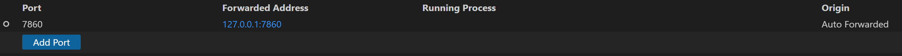
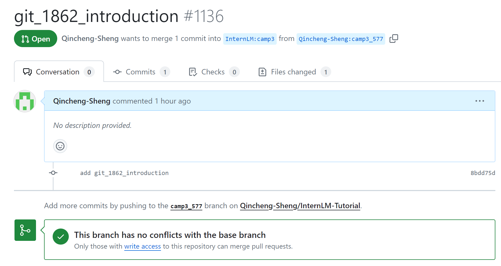
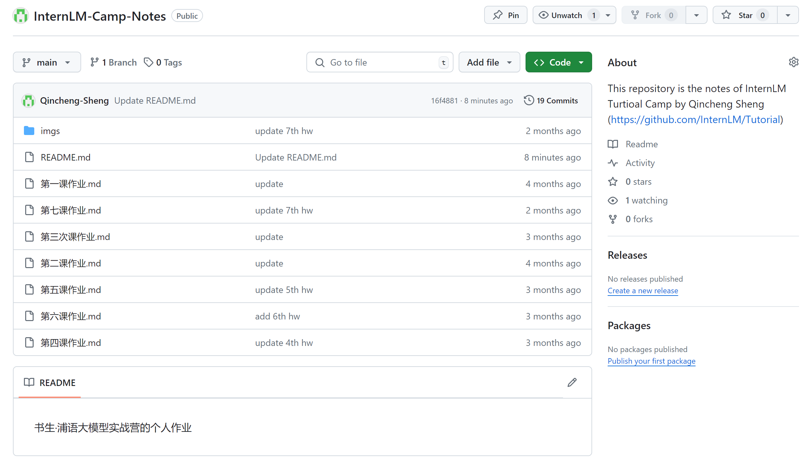
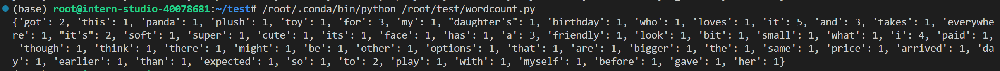
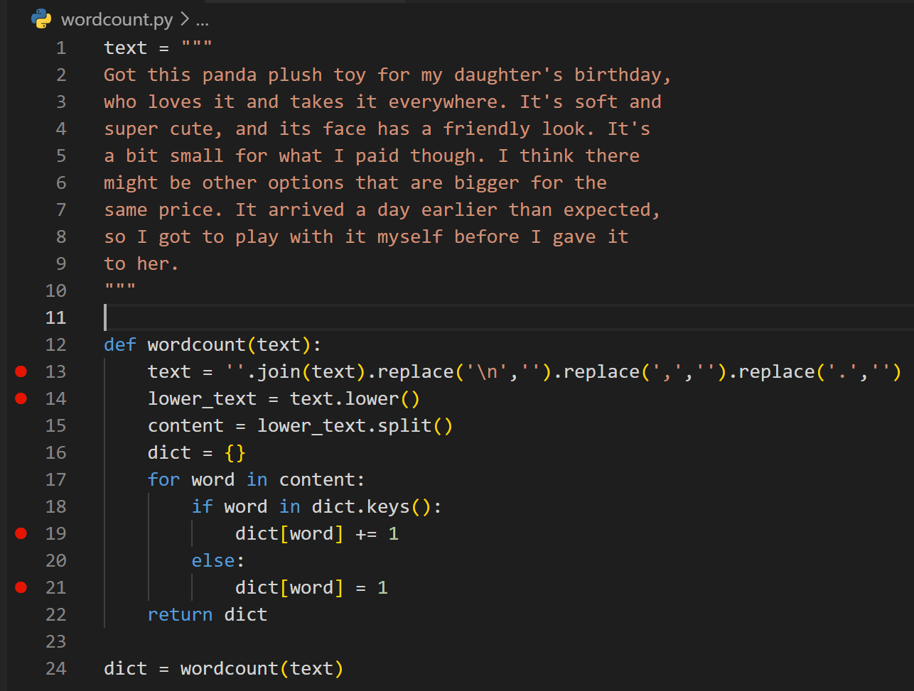

# Linux + InternStudio 关卡

![[hello_word.png]]


# Git 关卡
## 任务1 自我介绍
https://github.com/InternLM/Tutorial/pull/1136


## 任务2 个人项目
https://github.com/Qincheng-Sheng/InternLM-Camp-Notes/tree/main


# Python 关卡
## 任务1 实现一个wordcount函数
```python
def wordcount(text):
    text = ''.join(text).replace('\n','').replace(',','').replace('.','')
    lower_text = text.lower()
    content = lower_text.split()
    dict = {}
    for word in content:
        if word in dict.keys():
            dict[word] += 1
        else:
            dict[word] = 1
    return dict
```
输出为

```python
{'got': 2, 'this': 1, 'panda': 1, 'plush': 1, 'toy': 1, 'for': 3, 'my': 1, "daughter's": 1, 'birthday': 1, 'who': 1, 'loves': 1, 'it': 5, 'and': 3, 'takes': 1, 'everywhere': 1, "it's": 2, 'soft': 1, 'super': 1, 'cute': 1, 'its': 1, 'face': 1, 'has': 1, 'a': 3, 'friendly': 1, 'look': 1, 'bit': 1, 'small': 1, 'what': 1, 'i': 4, 'paid': 1, 'though': 1, 'think': 1, 'there': 1, 'might': 1, 'be': 1, 'other': 1, 'options': 1, 'that': 1, 'are': 1, 'bigger': 1, 'the': 1, 'same': 1, 'price': 1, 'arrived': 1, 'day': 1, 'earlier': 1, 'than': 1, 'expected': 1, 'so': 1, 'to': 2, 'play': 1, 'with': 1, 'myself': 1, 'before': 1, 'gave': 1, 'her': 1}
```
## 任务2 debug流程


13行断点：text
```python
text = "\nGot this panda plush toy for my daughter's birthday, \nwho loves it and takes it everywhere. It's soft and \nsuper cute, and its face has a friendly look. It's \na bit small for what I paid though. I think there \nmight be other options that are bigger for the \nsame price. It arrived a day earlier than expected, \nso I got to play with it myself before I gave it \nto her.\n"
```

14行断点：text
```python
text = "Got this panda plush toy for my daughter's birthday who loves it and takes it everywhere It's soft and super cute and its face has a friendly look It's a bit small for what I paid though I think there might be other options that are bigger for the same price It arrived a day earlier than expected so I got to play with it myself before I gave it to her"
```

19行和21行断点：content, dict
```python
content = ['got', 'this', 'panda', 'plush', 'toy', 'for', 'my', "daughter's", 'birthday', 'who', 'loves', 'it', 'and', 'takes', 'it', 'everywhere', "it's", 'soft', 'and', 'super', 'cute', 'and', 'its', 'face', 'has', 'a', 'friendly', 'look', "it's", 'a', 'bit', 'small', 'for', 'what', 'i', 'paid', 'though', 'i', 'think', 'there', 'might', 'be', 'other', 'options', 'that', 'are', 'bigger', 'for', 'the', 'same', 'price', 'it', 'arrived', 'a', 'day', 'earlier', 'than', 'expected', 'so', ...]
dict = {}
```

执行for循环，之后变量dict内容不断增加


