## 书生·浦语大模型开源历程

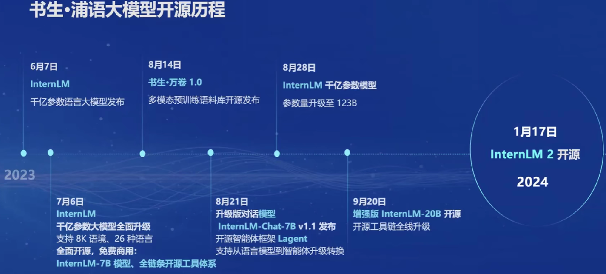

## 不同版本的模型

[GitHub](https://github.com/InternLM/InternLM)
[HuggingFace](https://huggingface.co/internlm)
Models、ToolChain、Applications

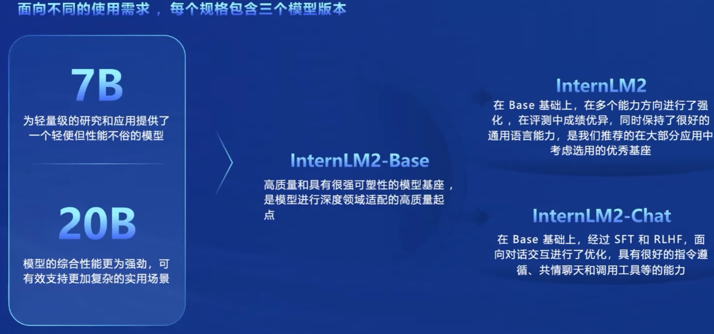

# 模型如何到应用

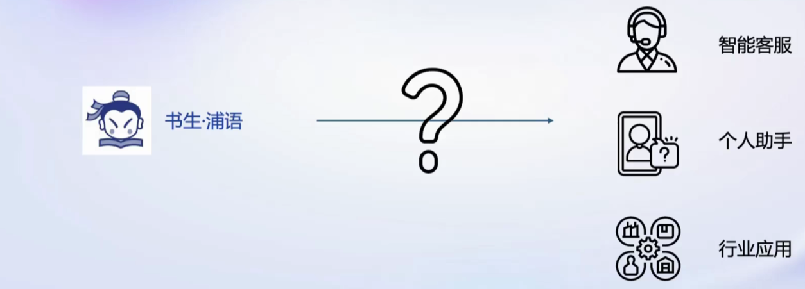
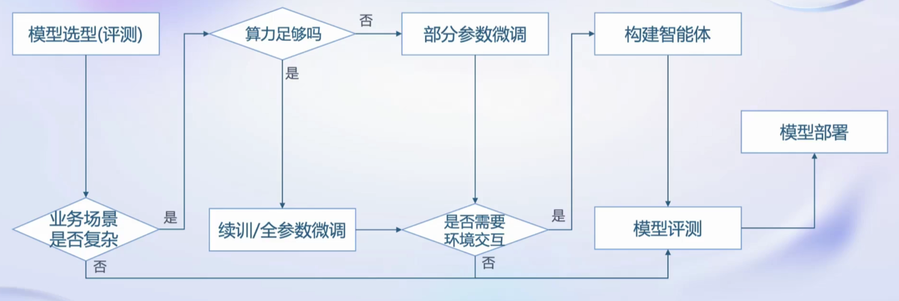

# 全链条开放体系

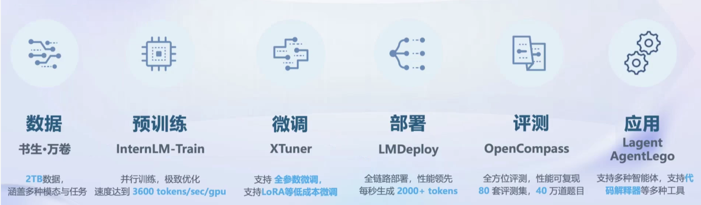

## 数据

### [OpenDatalab](https://opendatalab.com/home)
OpenDataLab 为大模型提供高质量的开放数据集
有[数据集](https://opendatalab.com/) (预训练，微调，评测)，[标注工具](https://opendatalab.com/labelU)

### [书生·万卷1.0](https://opendatalab.com/OpenDataLab/WanJuan1_dot_0)
书生·万卷1.0为书生·万卷多模态语料库的首个开源版本
包含**文本数据集、图文数据集、视频数据集**三部分，数据总量超过**2TB**
论文地址：[https://arxiv.org/pdf/2308.10755.pdf](https://arxiv.org/pdf/2308.10755.pdf)

### [书生·万卷CC](https://opendatalab.com/OpenDataLab/WanJuanCC)
是从 CommonCrawl 获取的一个 **1T** Tokens 的高质量**英文网络文本数据集**

## 预训练 InternLM-Train

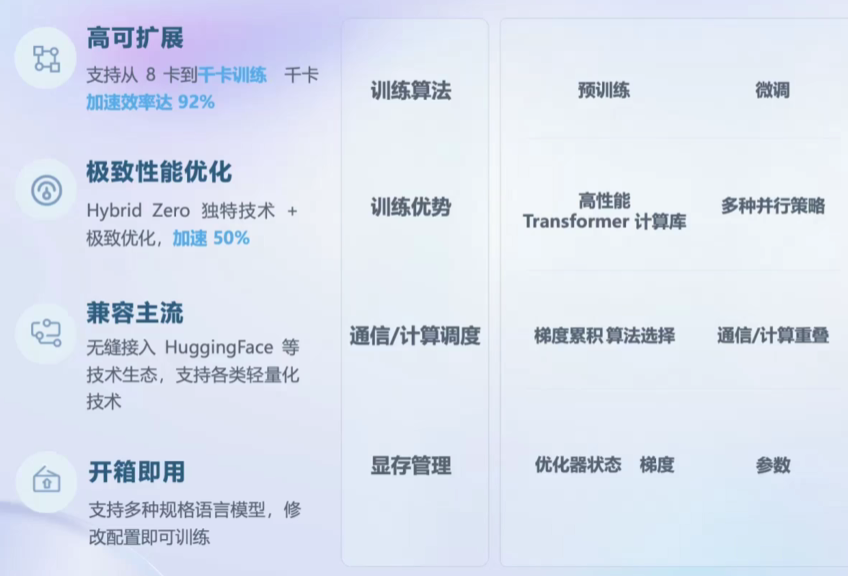

## 微调

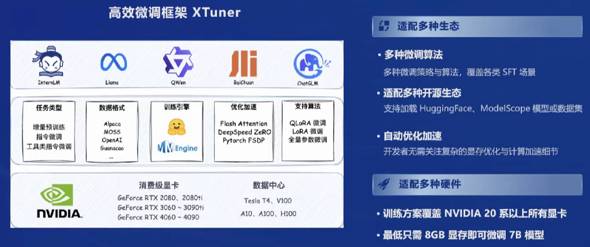

## 评测

[OpenCompass](https://opencompass.org.cn/home)
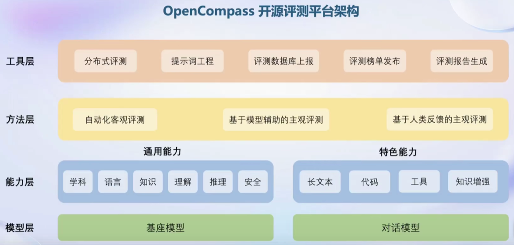

## 部署

## 应用

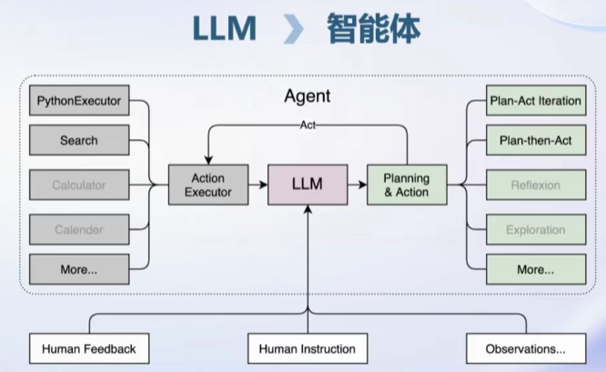

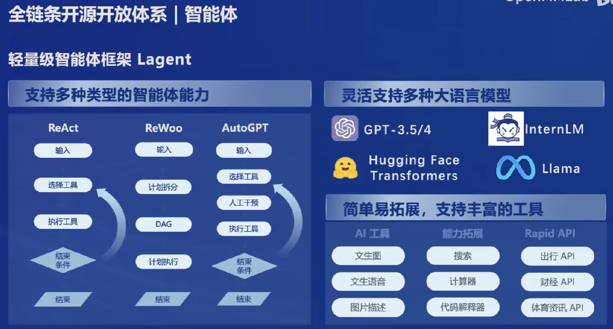

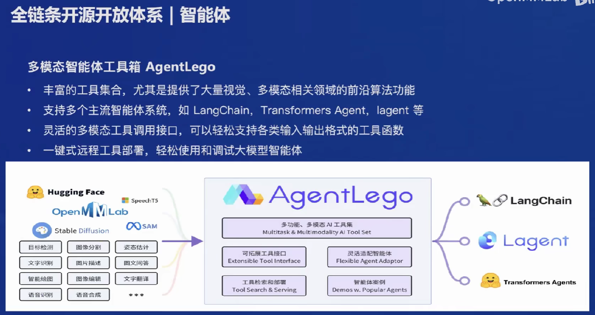