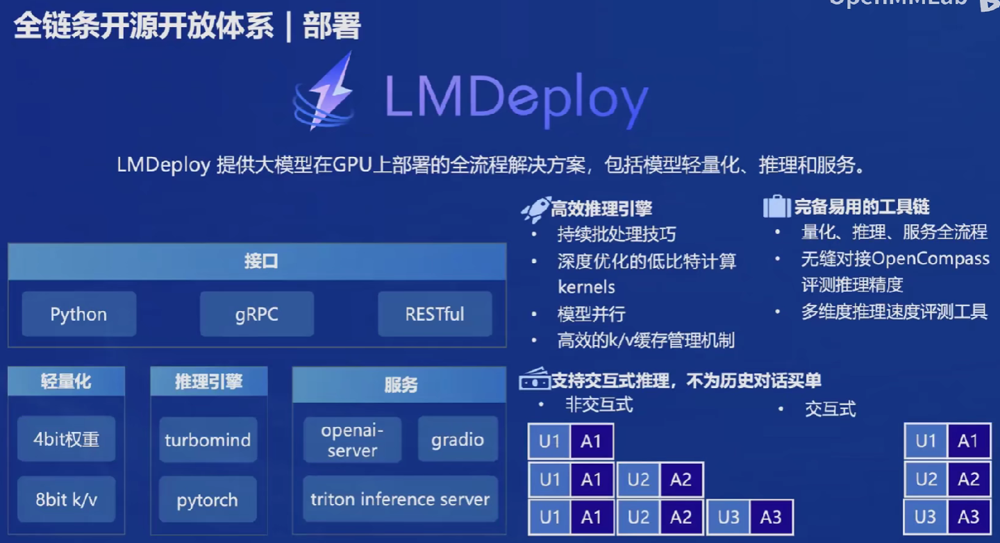

## 书生·浦语大模型开源历程

## 不同版本的模型

[GitHub](https://github.com/InternLM/InternLM)
[HuggingFace](https://huggingface.co/internlm)
Models、ToolChain、Applications

[InternLM2-1.8B](https://github.com/InternLM/InternLM/blob/main/model_cards/internlm2_1.8b.md)
[InternLM2-7B](https://github.com/InternLM/InternLM/blob/main/model_cards/internlm2_7b.md)
[InternLM2-20B](https://github.com/InternLM/InternLM/blob/main/model_cards/internlm2_20b.md)
https://huggingface.co/blog/zh/rlhf
https://zhuanlan.zhihu.com/p/591474085

# 模型如何到应用

	1、模型选型：选择合适的基础模型
	2、判断业务场景是否复杂：复杂则根据算力决定 全参数/续参数微调，还是部分参数微调
	3、判断是否要和环境交互：如何构建智能体
	4、模型评测
	5、模型部署

## 如何加载模型

[chat模型加载](https://github.com/InternLM/InternLM/blob/main/chat/README_zh-CN.md)
transformer, modelscope?

## 如何微调
  
对大型模型（如BERT、GPT、ResNet等）进行微调是一个强大的技术，可以让你利用预先训练好的模型，并针对特定任务进行优化。以下是对大型模型进行微调的一般步骤：
### 1. 选择合适的预训练模型
-   根据你的**任务类型**（如文本分类、图像识别、语言生成等）选择一个适合的预训练模型。考虑模型的**大小、性能**以及**训练数据的相关性**。
### 2. 准备你的数据集
-   **数据清洗**：确保你的数据是干净和格式统一的。
-   **分割数据**：通常需要将数据分为训练集、验证集和测试集。
-   **适配模型输入**：根据选定模型的要求，可能需要对数据进行特定的预处理。例如，对于文本任务，可能需要添加特殊的分隔符或将文本转换为模型能理解的格式。
### 3. 微调的设置
-   **学习率**：选择一个相对较小的学习率开始微调，因为预训练模型已经在一个或多个任务上学到了有用的表示。过大的学习率可能会破坏这些表示。
-   **冻结层**：在一些情况下，你可能会选择冻结模型的一部分，只对模型的最后几层进行微调。这可以减少计算需求并防止过拟合。
-   **优化器**：选择合适的优化器，如AdamW是微调许多预训练语言模型的流行选择。
### 4. 微调模型
-   使用你的训练数据对模型进行微调。这通常涉及到使用一个**较小的批次大小**和**较少的训练周期**，因为模型已经进行了预训练。
-   监控验证集上的性能，以**调整学习率、早停**（early stopping）等超参数，并防止过拟合。
### 5. 评估和部署
-   在保留的测试集上**评估微调后的模型性能**，确保模型在未见过的数据上表现良好。
-   一旦满意，你可以将微调后的模型部署到生产环境中。
### 注意事项
-   **计算资源**：微调大型模型需要相当的计算资源，特别是对于图像和视频模型。确保你有足够的GPU或其他硬件资源。
-   **过拟合**：由于预训练模型的强大表示能力，微调时很容易过拟合。使用正则化技术，如dropout，以及在训练过程中密切监控验证集的性能。
-   **数据不平衡**：如果你的数据集存在类别不平衡的情况，考虑使用加权损失函数或其他技术来缓解这一问题。

微调大型模型是迁移学习的一种形式，可以显著提高特定任务的性能。正确实施时，它允许你利用大型模型在广泛数据上学到的通用知识，而无需从头开始训练模型。

## 如何构建智能体

构建基于大型模型的智能体，如基于GPT或BERT的自然语言处理智能体，或基于ResNet等模型的视觉智能体，涉及到将大型模型集成到智能体框架中，以使其能够进行决策、学习和交互。以下是构建这种智能体的一般步骤：
### 1. 明确智能体的任务
首先，你需要明确智能体的目标任务。智能体的任务可能包括但不限于：
-   **文本生成**：如自动回复邮件、编写文章等。
-   **问答系统**：回答用户提出的问题。
-   **图像识别**：识别和分类图像中的对象。
-   **推荐系统**：根据用户的历史行为推荐内容。
### 2. 选择和准备预训练模型
-   根据智能体的任务选择合适的预训练模型。例如，使用GPT-3进行文本生成，使用BERT进行问答系统，或使用ResNet进行图像识别。
-   对模型进行必要的微调以适应特定任务，这可能涉及到收集和准备相关的训练数据。
### 3. 定义智能体的决策逻辑
-   **状态表示**：定义智能体观察到的环境状态，这可能是文本、图像、或其他形式的数据。
-   **动作空间**：定义智能体可以执行的动作。对于基于文本的智能体，动作可能是生成的文本回复；对于视觉智能体，动作可能是分类标签。
-   **策略**：定义智能体如何基于当前状态选择动作。这可能涉及到策略网络或决策树。
### 4. 集成反馈机制
-   智能体的学习通常依赖于反馈。这可能是通过强化学习中的奖励信号，或者通过用户反馈。
-   **设计和实现反馈机制，使智能体能够根据反馈进行自我改进**。
### 5. 开发交互界面
-   根据智能体的应用场景，开发用户交互界面。这可能是一个聊天界面、Web应用程序或其他用户接口。
-   确保智能体的响应时间符合实时交互的要求。
### 6. 测试和评估
-   在真实或近似真实的环境中测试智能体的性能，评估其在实际任务中的表现。
-   收集用户反馈，对智能体进行迭代改进。
### 7. 部署和维护
-   将智能体部署到目标平台，如服务器、云服务或边缘设备。
-   定期更新智能体，以纳入新的数据、改进的模型和修复的漏洞。
### 注意事项
-   **隐私和安全**：在处理用户数据时，确保遵守相关的隐私保护法规，采取适当的数据保护措施。
-   **伦理和公平性**：确保智能体的行为和决策遵循伦理标准，避免偏见和不公平。

构建基于大型模型的智能体是一个迭代和多学科的过程，涉及到机器学习、软件工程、用户体验设计等多个领域。通过不断迭代和优化，可以开发出能够有效解决特定任务的智能体。

# 全链条开放体系

## 数据

### [OpenDatalab](https://opendatalab.com/home)
OpenDataLab 为大模型提供高质量的开放数据集
有[数据集](https://opendatalab.com/) (预训练，微调，评测)，[标注工具](https://opendatalab.com/labelU)

### [书生·万卷1.0](https://opendatalab.com/OpenDataLab/WanJuan1_dot_0)
书生·万卷1.0为书生·万卷多模态语料库的首个开源版本
包含**文本数据集、图文数据集、视频数据集**三部分，数据总量超过**2TB**
论文地址：[https://arxiv.org/pdf/2308.10755.pdf](https://arxiv.org/pdf/2308.10755.pdf)

### [书生·万卷CC](https://opendatalab.com/OpenDataLab/WanJuanCC)
是从 CommonCrawl 获取的一个 **1T** Tokens 的高质量**英文网络文本数据集**

## 预训练 InternLM-Train

[InternEvo 预训练](https://github.com/InternLM/InternEvo/blob/develop/README-zh-Hans.md)
InternEvo是一个开源的轻量级训练框架，旨在支持无需大量依赖关系的模型预训练。凭借单一代码库，InternEvo支持在具有上千GPU的大规模集群上进行预训练，并在单个GPU上进行微调，同时可实现显著的性能优化。当在1024个GPU上进行训练时，InternEvo可实现近90%的加速效率。

### 什么是预训练

大模型的预训练（pre-training）指的是在一个**广泛的数据集上训练大型神经网络模型**，以学习**通用的特征和模式**的过程。这一步骤通常在模型被应用到特定任务之前进行，目的是让模型能够捕获丰富的先验知识，这些知识可以帮助模型在**后续的特定任务**（如文本分类、情感分析、图像识别等）**上表现更好**。

### 预训练的主要目的和好处包括：
-   **提高效率**：预训练模型可以显著**减少针对特定任务的训练时间和计算资源消耗**，因为模型已经学习了大量的通用特征和知识。
-   **提高性能**：通过预训练，模型能够在**数据稀缺的情况下表现得更好**，因为它已经在大规模数据集上学习了有用的表示。这对于数据受限的任务尤其重要。
-   **泛化能力**：预训练使得模型在面对新领域或任务时拥有**更好的泛化能力**，因为它已经学习到了跨领域的通用知识。

### 预训练的常见方法：
-   **无监督学习**：在无标签的数据上训练模型，使其学习数据的分布或结构。对于文本数据，这可能涉及到预测缺失的单词或句子；对于图像数据，这可能涉及到重建被遮挡的图像部分。
-   **自监督学习**：这是一种特殊形式的无监督学习，其中模型被训练来预测其输入数据的某些部分。例如，BERT模型通过掩码语言模型（MLM）任务进行预训练，其中模型学习预测句子中被随机掩盖的单词。
-   **监督学习**：在有标签的大规模数据集上进行预训练。这比较少见，因为收集大量有标签的数据成本较高。

### 预训练模型的应用：

预训练模型可以**被用于各种下游任务**。通常，这涉及到对预训练模型进行微调（fine-tuning），即在特定任务的数据集上继续训练模型，调整模型参数以适应该任务。微调可以在整个模型上进行，也可以只针对模型的一部分（例如最后几层）。通过这种方式，预训练模型可以适应包括文本分类、情感分析、图像识别、语言生成等各种任务。

总的来说，大模型的预训练为深度学习模型提供了一种强大的启动知识，使其能够在处理更复杂、更特定的任务时表现得更加出色。

## 微调

[微调 InternLM](https://github.com/InternLM/InternLM/blob/main/finetune/README_zh-CN.md)
[XTuner](https://github.com/InternLM/xtuner/blob/main/README_zh-CN.md)
XTuner 是一个高效、灵活、全能的轻量化大模型微调工具库。

## 评测

[OpenCompass](https://opencompass.org.cn/home)
[VLMEvalKit](https://github.com/open-compass/VLMEvalKit)

## 部署

[LMDeploy部署工具箱](https://github.com/InternLM/InternLM/blob/main/chat/lmdeploy_zh_cn.md)
[LMDeploy中文教程](https://lmdeploy.readthedocs.io/zh-cn/latest/)

[OpenAOE 多模型对话](https://github.com/InternLM/InternLM/blob/main/chat/openaoe_zh_cn.md)

## 应用

[InternLM-Chat 智能体](https://github.com/InternLM/InternLM/blob/main/agent/README_zh-CN.md)
[Lagent 介绍](https://github.com/InternLM/InternLM/blob/main/agent/lagent_zh-CN.md)

[Lagent](https://github.com/InternLM/lagent) 是一个轻量级、开源的基于大语言模型的智能体（agent）框架，支持用户快速地将一个大语言模型转变为多种类型的智能体，并提供了一些典型工具为大语言模型赋能。它的整个框架图如下:

Lagent consists of 3 main parts, agents, llms, and actions.
-   **agents** provides agent implementation, such as ReAct, AutoGPT.
-   **llms** supports various large language models, including open-sourced models (Llama-2, InterLM) through HuggingFace models or closed-source models like GPT3.5/4.
-   **actions** contains a series of actions, as well as an action executor to manage all actions.

[GitHub AgentLego](https://github.com/InternLM/agentlego/blob/main/README_zh-CN.md)

