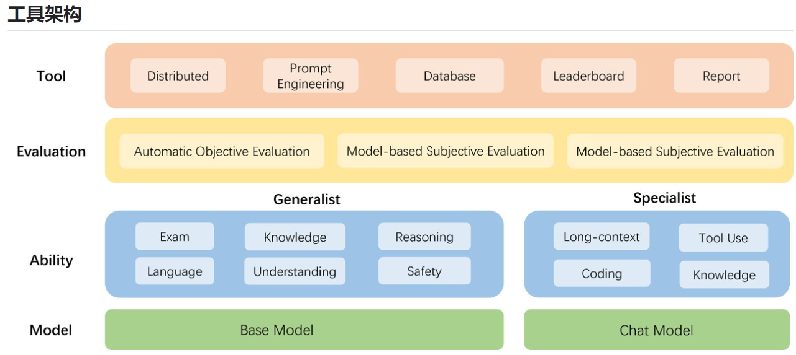
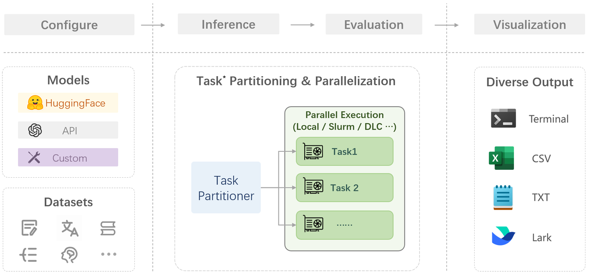
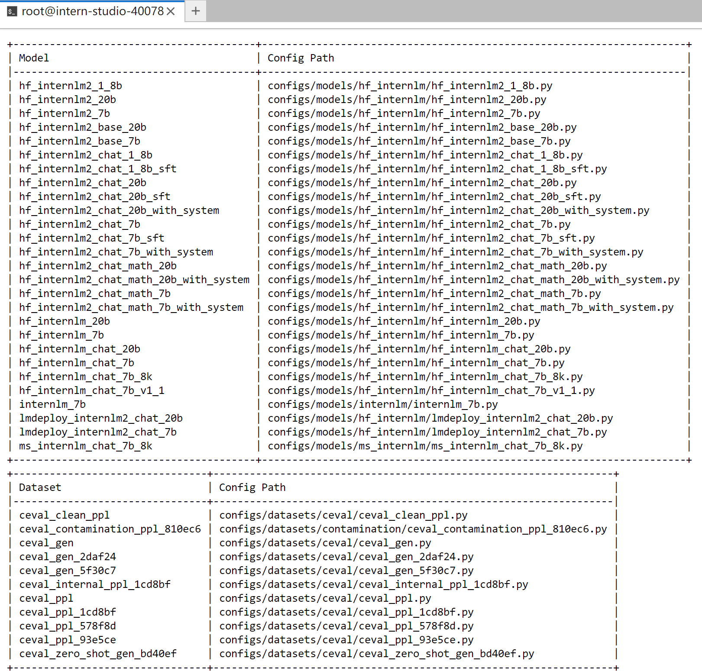
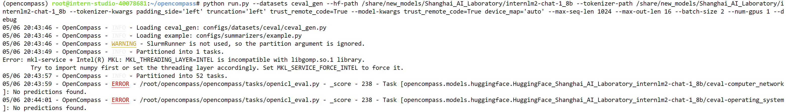
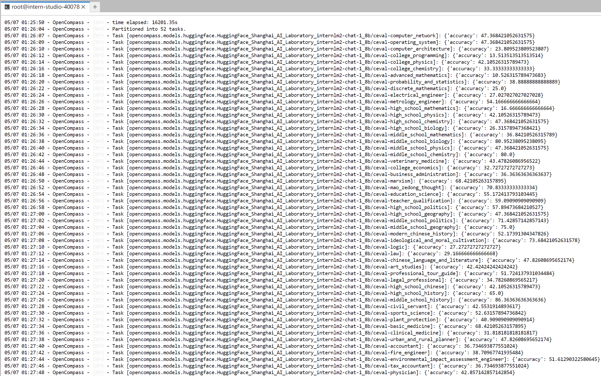
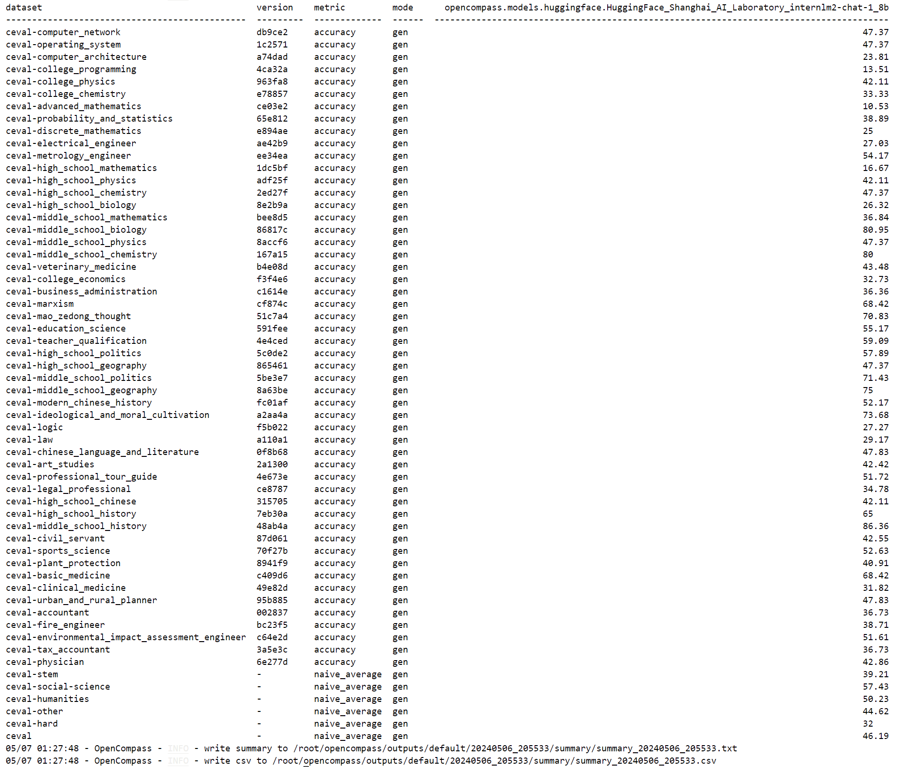

# Opencompass 介绍



-   模型层：大模型评测所涉及的主要模型种类，OpenCompass 以基座模型和对话模型作为重点评测对象。
-   能力层：OpenCompass 从本方案从通用能力和特色能力两个方面来进行评测维度设计。在模型通用能力方面，从语言、知识、理解、推理、安全等多个能力维度进行评测。在特色能力方面，从长文本、代码、工具、知识增强等维度进行评测。
-   方法层：OpenCompass 采用客观评测与主观评测两种评测方式。客观评测能便捷地评估模型在具有确定答案（如选择，填空，封闭式问答等）的任务上的能力，主观评测能评估用户对模型回复的真实满意度，OpenCompass 采用基于模型辅助的主观评测和基于人类反馈的主观评测两种方式。
-   工具层：OpenCompass 提供丰富的功能支持自动化地开展大语言模型的高效评测。包括分布式评测技术，提示词工程，对接评测数据库，评测榜单发布，评测报告生成等诸多功能。



# 实测

## 面向GPU的环境安装


```bash
studio-conda -o internlm-base -t opencompass
source activate opencompass
git clone -b 0.2.4 https://github.com/open-compass/opencompass
cd opencompass
pip install -e .
```

**如果pip install -e .安装未成功,请运行:**

```
pip install -r requirements.txt
```

requirements.txt
```txt
absl-py
accelerate>=0.19.0
boto3
cn2an
cpm_kernels
datasets>=2.12.0
einops==0.5.0
evaluate>=0.3.0
fairscale
func_timeout
fuzzywuzzy
immutabledict
jieba
json5
langdetect
ltp
mmengine-lite
nltk==3.8
numpy>=1.23.4
openai
OpenCC
opencv-python-headless
pandas<2.0.0
prettytable
pyext
pypinyin
python-Levenshtein
rank_bm25==0.2.2
rapidfuzz
requests==2.31.0
rich
rouge
-e git+https://github.com/Isaac-JL-Chen/rouge_chinese.git@master#egg=rouge_chinese
rouge_score
sacrebleu
scikit_learn==1.2.1
seaborn
sentence_transformers==2.2.2
tabulate
tiktoken
timeout_decorator
tokenizers>=0.13.3
torch>=1.13.1
tqdm==4.64.1
transformers>=4.29.1
typer
```

有部分第三方功能,如代码能力基准测试 HumanEval 以及 Llama 格式的模型评测,可能需要额外步骤才能正常运行，如需评测，详细步骤请参考安装指南。

## 数据准备


解压评测数据集到 data/ 处

```bash
cp /share/temp/datasets/OpenCompassData-core-20231110.zip /root/opencompass/
unzip OpenCompassData-core-20231110.zip
```

将会在 OpenCompass 下看到data文件夹

## 查看支持的数据集和模型

列出所有跟 InternLM 及 C-Eval 相关的配置

```
python tools/list_configs.py internlm ceval
```

报错，需要先安装 mmengine
```bash
# ModuleNotFoundError: No module named 'mmengine'
pip install mmengine

## 或者
cd requirements && pip install -r runtime.txt
```

最终效果如下：


## 启动评测 (10% A100 8GB 资源)

确保按照上述步骤正确安装 OpenCompass 并准备好数据集后，可以通过以下命令评测 InternLM2-Chat-1.8B 模型在 C-Eval 数据集上的性能。由于 OpenCompass 默认并行启动评估过程，我们可以在第一次运行时以 --debug 模式启动评估，并检查是否存在问题。在 --debug 模式下，任务将按顺序执行，并实时打印输出。

```bash
python run.py
--datasets ceval_gen \
--hf-path /share/new_models/Shanghai_AI_Laboratory/internlm2-chat-1_8b \  # HuggingFace 模型路径
--tokenizer-path /share/new_models/Shanghai_AI_Laboratory/internlm2-chat-1_8b \  # HuggingFace tokenizer 路径（如果与模型路径相同，可以省略）
--tokenizer-kwargs padding_side='left' truncation='left' trust_remote_code=True \  # 构建 tokenizer 的参数
--model-kwargs device_map='auto' trust_remote_code=True \  # 构建模型的参数
--max-seq-len 1024 \  # 模型可以接受的最大序列长度
--max-out-len 16 \  # 生成的最大 token 数
--batch-size 2  \  # 批量大小
--num-gpus 1  # 运行模型所需的 GPU 数量
--debug
```

## 遇到报错

mkl-service + Intel(R) MKL MKL_THREADING_LAYER=INTEL is incompatible with libgomp.so.1 



**解决方案：**
```bash
pip install protobuf
export MKL_SERVICE_FORCE_INTEL=1
export MKL_THREADING_LAYER=GNU
```

## 最终结果

屏幕上显示 “Starting inference process”
评测完成后看到：



