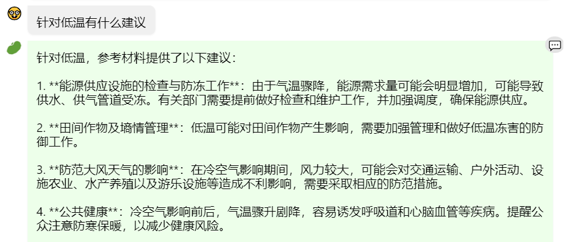
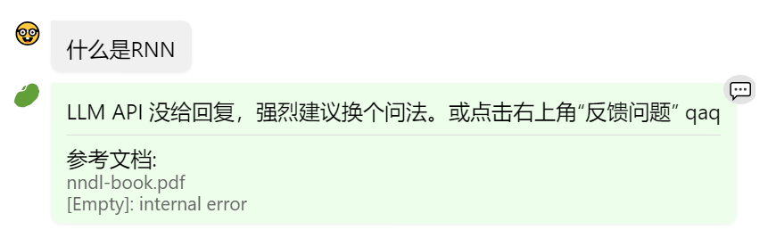
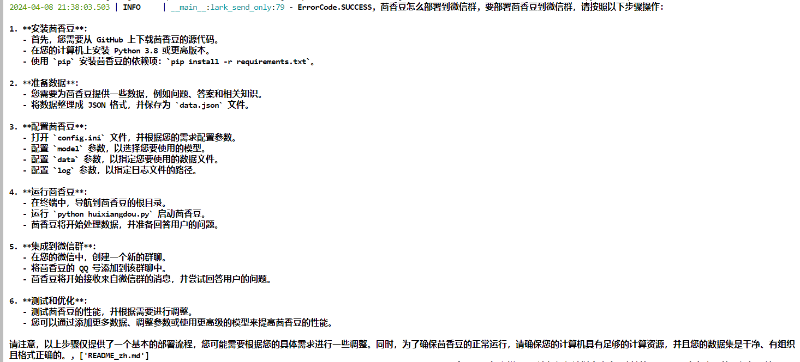

https://github.com/InternLM/Tutorial/tree/camp2/huixiangdou#%E4%BD%9C%E4%B8%9A

# RAG 技术

## RAG 概述

RAG（Retrieval Augmented Generation）检索增强生成技术
简单来说 RAG 可以理解为一个搜索引擎，将用户输入在**外部知识库进行索引**，结合大语言模型的能力**生成回答**


## RAG 工作原理

分为三个部分：索引、检索、生成
### 索引 Indexing
处理外部知识源，将知识源**分割**为chunk，**编码**为向量，**存储**在向量数据库 **Vetor-DataBase** 中

### 检索 Retrieval
接受用户问题，将问题**编码**为向量，用这些向量去向量数据库中**找到最相关的文档库** top-k chunks

### 生成 Generation
将检索到的文档与原始问题一起作为**提示** （Promot）输入到LLM中，生成回答


## 向量数据库 Vector-DB

[Vecto-DB](https://github.com/chenzomi12/AISystem/blob/main/06Foundation/05Dataset/04VectorDB/02VectorDB.pdf)


# 茴香豆 RAG 助手

[GitHub网址](https://github.com/InternLM/HuixiangDou/blob/main/README_zh.md)

茴香豆是一个基于 LLM 的**群聊**知识助手，优势：
1.  设计拒答、响应两阶段 pipeline 应对群聊场景，解答问题同时不会消息泛滥。精髓见[技术报告](https://arxiv.org/abs/2401.08772)
2.  成本低至 1.5G 显存，无需训练适用各行业
3.  提供一整套前后端 web、android、算法源码，工业级开源可商用

## 数据库向量化

[GitHub text2vec](https://github.com/shibing624/text2vec)

提取知识库特征，创建向量数据库。
**数据库向量化**的过程应用到了 **LangChain** 的相关模块

## BCE 模型

[GitHub BCE嵌入和重排序](https://github.com/netease-youdao/BCEmbedding)
[BCE嵌入和重排序技术报告](https://zhuanlan.zhihu.com/p/681370855)

默认**嵌入和重排序**模型调用的网易 **BCE 双语模型**，如果没有在 `config.ini` 文件中指定本地模型路径，茴香豆将自动从 **HuggingFace** 拉取默认模型。

模型地址
[Hugging Face BCE 嵌入模型](https://huggingface.co/maidalun1020/bce-embedding-base_v1)
[Hugging Face BCE 重排序模型](https://huggingface.co/maidalun1020/bce-reranker-base_v1)

## 如何本地运行茴香豆 RAG

[茴香豆Web](https://github.com/InternLM/HuixiangDou/tree/main/web)
[2G部署茴香豆](https://zhuanlan.zhihu.com/p/685205206)

## 文件结构

通过了解主要文件的位置和作用，可以更好的理解茴香豆的工作原理。

```txt
├── LICENSE
├── README.md
├── README_zh.md
├── android
├── app.py
├── config-2G.ini
├── config-advanced.ini
├── config-experience.ini
├── config.ini # 配置文件
├── docs # 教学文档
├── huixiangdou # 存放茴香豆主要代码，重点学习
├── huixiangdou-inside.md
├── logs
├── repodir # 默认存放个人数据库原始文件，用户建立
├── requirements-lark-group.txt
├── requirements.txt
├── resource
├── setup.py
├── tests # 单元测试
├── web # 存放茴香豆 Web 版代码
└── web.log
└── workdir # 默认存放茴香豆本地向量数据库，用户建立
```

```txt
./huixiangdou
├── __init__.py
├── frontend # 存放茴香豆前端与用户端和通讯软件交互代码
│   ├── __init__.py
│   ├── lark.py
│   └── lark_group.py
├── main.py # 运行主贷
├── service # 存放茴香豆后端工作流代码
│   ├── __init__.py
│   ├── config.py #
│   ├── feature_store.py # 数据嵌入、特征提取代码
│   ├── file_operation.py
│   ├── helper.py
│   ├── llm_client.py
│   ├── llm_server_hybrid.py # 混合模型代码
│   ├── retriever.py # 检索模块代码
│   ├── sg_search.py # 增强搜索，图检索代码
│   ├── web_search.py # 网页搜索代码
│   └── worker.py # 主流程代码
└── version.py
```

茴香豆工作流中用到的 **Prompt** 位于 `huixiangdou/service/worker.py` 中。可以根据业务需求尝试调整 **Prompt**，打造你独有的茴香豆知识助手。

```python
# Switch languages according to the scenario.
if self.language == 'zh':
	self.TOPIC_TEMPLATE = '告诉我这句话的主题，直接说主题不要解释：“{}”'
	self.SCORING_QUESTION_TEMPLTE = '“{}”\n请仔细阅读以上内容，判断句子是否是个有主题的疑问句，结果用 0～10 表示。直接提供得分不要解释。\n判断标准：有主语谓语宾语并且是疑问句得 10 分；缺少主谓宾扣分；陈述句直接得 0 分；不是疑问句直接得 0 分。直接提供得分不要解释。'  # noqa E501
	self.SCORING_RELAVANCE_TEMPLATE = '问题：“{}”\n材料：“{}”\n请仔细阅读以上内容，判断问题和材料的关联度，用0～10表示。判断标准：非常相关得 10 分；完全没关联得 0 分。直接提供得分不要解释。\n'  # noqa E501
	self.KEYWORDS_TEMPLATE = '谷歌搜索是一个通用搜索引擎，可用于访问互联网、查询百科知识、了解时事新闻等。搜索参数类型 string， 内容是短语或关键字，以空格分隔。\n你现在是{}交流群里的技术助手，用户问“{}”，你打算通过谷歌搜索查询相关资料，请提供用于搜索的关键字或短语，不要解释直接给出关键字或短语。'  # noqa E501
	self.SECURITY_TEMAPLTE = '判断以下句子是否涉及政治、辱骂、色情、恐暴、宗教、网络暴力、种族歧视等违禁内容，结果用 0～10 表示，不要解释直接给出得分。判断标准：涉其中任一问题直接得 10 分；完全不涉及得 0 分。直接给得分不要解释：“{}”'  # noqa E501
	self.PERPLESITY_TEMPLATE = '“question:{} answer:{}”\n阅读以上对话，answer 是否在表达自己不知道，回答越全面得分越少，用0～10表示，不要解释直接给出得分。\n判断标准：准确回答问题得 0 分；答案详尽得 1 分；知道部分答案但有不确定信息得 8 分；知道小部分答案但推荐求助其他人得 9 分；不知道任何答案直接推荐求助别人得 10 分。直接打分不要解释。'  # noqa E501
	self.SUMMARIZE_TEMPLATE = '{} \n 仔细阅读以上内容，总结得简短有力点'  # noqa E501
	# self.GENERATE_TEMPLATE = '材料：“{}”\n 问题：“{}” \n 请仔细阅读参考材料回答问题，材料可能和问题无关。如果材料和问题无关，尝试用你自己的理解来回答问题。如果无法确定答案，直接回答不知道。'  # noqa E501
	self.GENERATE_TEMPLATE = '材料：“{}”\n 问题：“{}” \n 请仔细阅读参考材料回答问题。'  # noqa E501
```

# 作业

## 1、在[茴香豆 Web 版](https://openxlab.org.cn/apps/detail/tpoisonooo/huixiangdou-web)中创建自己领域的知识问答助手

上传了一个官方的天气报告，里面的内容为12月15日至25日的天气情况，并测试了几个问题

###  简单的天气情况

 查询18日的天气，可以看到回答很好，有天气情况和温度情况
 


### 天气情况对比

 将18日和20日的天气情况进行对比，回答比较了18日和20日的温度情况，并且也有分析，因为18日有雨夹雪所以气温低，非常好


### 天气寒冷的建议

  回答对文档中的知识进行了提炼，比较适中，很不错
  

![[低温建议2.png]]

### 最新的天气情况

 这个回答给出了所有天气的情况，不是很理想


### 尝试上传一个技术文档会无法回答



综上可以看到，在解决一些具体问题，例如天气，服务，文档报表等，茴香豆Web还是有着不错的表现，但是当文档内容比较复杂或者问题比较复杂，就无法回答的比较好了

## 2、在 `InternLM Studio` 上部署茴香豆技术助手




### 第一步：配置环境

参考上一节课的配置
```python
conda create -n demo python==3.10 -y
conda activate demo

conda install pytorch==2.0.1 torchvision==0.15.2 torchaudio==2.0.2 pytorch-cuda=11.7 -c pytorch -c nvidia
pip install huggingface-hub==0.17.3
pip install transformers==4.39.3 
pip install psutil==5.9.8
pip install accelerate==0.28.0
pip install streamlit==1.32.2 
pip install matplotlib==3.8.3 
pip install modelscope==1.9.5
pip install sentencepiece==0.1.99
```

### 第二步：下载模型

```python
# 创建模型文件夹
cd /root && mkdir models

# 复制BCE模型
ln -s /root/share/new_models/maidalun1020/bce-embedding-base_v1 /root/models/bce-embedding-base_v1
ln -s /root/share/new_models/maidalun1020/bce-reranker-base_v1 /root/models/bce-reranker-base_v1

# 复制大模型参数
ln -s /root/share/new_models/Shanghai_AI_Laboratory/internlm2-chat-7b /root/models/internlm2-chat-7b
```

### 第三步：安装茴香豆

安装茴香豆运行所需依赖
```python
# 安装 python 依赖
# pip install -r requirements.txt

pip install protobuf==4.25.3 accelerate==0.28.0 aiohttp==3.9.3 auto-gptq==0.7.1 bcembedding==0.1.3 beautifulsoup4==4.8.2 einops==0.7.0 faiss-gpu==1.7.2 langchain==0.1.14 loguru==0.7.2 lxml_html_clean==0.1.0 openai==1.16.1 openpyxl==3.1.2 pandas==2.2.1 pydantic==2.6.4 pymupdf==1.24.1 python-docx==1.1.0 pytoml==0.1.21 readability-lxml==0.8.1 redis==5.0.3 requests==2.31.0 scikit-learn==1.4.1.post1 sentence_transformers==2.2.2 textract==1.6.5 tiktoken==0.6.0 transformers==4.39.3 transformers_stream_generator==0.0.5 unstructured==0.11.2 gradio==4.25.0 flask==3.0.2 lark_oapi==1.2.4

## 因为 Intern Studio 不支持对系统文件的永久修改，在 Intern Studio 安装部署的同学不建议安装 Word 依赖，后续的操作和作业不会涉及 Word 解析。

## 想要自己尝试解析 Word 文件的同学，uncomment 掉下面这行，安装解析 .doc .docx 必需的依赖
# apt update && apt -y install python-dev python libxml2-dev libxslt1-dev antiword unrtf poppler-utils pstotext tesseract-ocr flac ffmpeg lame libmad0 libsox-fmt-mp3 sox libjpeg-dev swig libpulse-dev
```

从茴香豆官方仓库下载茴香豆
```python
cd /root
# 下载 repo
git clone https://github.com/internlm/huixiangdou && cd huixiangdou
git checkout 447c6f7e68a1657fce1c4f7c740ea1700bde0440
```

### 第四步：修改配置文件

**替换本地模型**

用已下载模型的路径替换 `/root/huixiangdou/config.ini` 文件中的默认模型，需要修改 3 处模型地址

在 **feature_store** 中
```
embedding_model_path   # 命令行输入下面的命令，修改用于向量数据库和词嵌入的模型
reranker_model_path    # 用于检索的重排序模型
```

在 **llm.server** 中

```
local_llm_path： # 选用的本地大模型
```


**设置网络连接**

开启网络搜索功能需要用到 **[Serper](https://serper.dev/)** 提供的 API：

在 **web_serch** 中
```
 x_api_key            # 将 ${YOUR-API-KEY} 替换为为自己的API-key
 domain_partial_order # 可以设置网络搜索的范围。
```

**使用远程模型**

茴香豆除了可以使用本地大模型，还可以轻松的调用云端模型 API。

目前，茴香豆已经支持 `Kimi`，`GPT-4`，`Deepseek` 和 `GLM` 等常见大模型API。

想要使用远端大模型，首先修改 `/huixiangdou/config.ini` 文件中

在 **llm** 中

```
enable_local = 0 # 关闭本地模型
enable_remote = 1 # 启用云端模型
```

接着，如下图所示，修改 `remote_` 相关配置，填写 API key、模型类型等参数。


也可以尝试同时开启 local 和 remote 模型，茴香豆将采用混合模型的方案

### 第五步：创建知识库

导入语料，**语料数据**保存在 **repodir** 中
```python
cd /root/huixiangdou && mkdir repodir
这一步可以将 **repodir** 中文件替换为自己的
# git clone https://github.com/internlm/huixiangdou --depth=1 repodir/huixiangdou
```

提取知识库特征，创建向量数据库。**数据库向量化**的过程应用到了 **LangChain** 的相关模块。
默认**嵌入和重排序模型**调用的网易 **BCE 双语模型**。
如果没有在 `config.ini` 文件中指定本地模型路径，将自动从 **HuggingFace** 拉取默认模型。

除了语料知识的向量数据库，茴香豆建立**接受和拒答两个向量数据库**，用来在检索的过程中更加精确的判断提问的相关性，这两个数据库的来源分别是：

-   接受问题列表，希望茴香豆助手回答的示例问题
    -   存储在 `huixiangdou/resource/good_questions.json` 中
-   拒绝问题列表，希望茴香豆助手拒答的示例问题
    -   存储在 `huixiangdou/resource/bad_questions.json` 中
    -   其中多为技术无关的主题或闲聊
    -   如："nihui 是谁", "具体在哪些位置进行修改？", "你是谁？", "1+1"

创建 RAG 检索过程中使用的**向量数据库**，保存在 **workdir** 中
```python
# 创建向量数据库存储目录
cd /root/huixiangdou && mkdir workdir 

# 分别向量化知识语料、接受问题和拒绝问题中后保存到 workdir
python3 -m huixiangdou.service.feature_store
```

向量数据库的创建需要等待一小段时间，过程约占用 1.6G 显存。
完成后，**Huixiangdou** 相关的新增知识就以向量数据库的形式存储在 **workdir** 文件夹下。

检索过程中，茴香豆会将输入问题与两个列表中的问题在向量空间进行相似性比较，判断该问题是否应该回答，避免群聊过程中的问答泛滥。

确定的回答的问题会利用基础模型提取关键词，在知识库中检索 `top K` 相似的 `chunk`，综合问题和检索到的 `chunk` 生成答案。

**注**：如果 retriever.py文件 报错 AssertionError
可以增大 huixiongdou/huixiangdou/service/retriever.py 中的 def query 的 content_max_length

### 第六步：运行茴香豆知识助手

```python
# 填入问题
sed -i '74s/.*/    queries = ["huixiangdou 是什么？", "茴香豆怎么部署到微信群", "今天天气怎么样？"]/' /root/huixiangdou/huixiangdou/main.py

# 运行茴香豆
cd /root/huixiangdou/
python3 -m huixiangdou.main --standalone

# 运行网页Demo
python3 -m tests.test_query_gradio --work_dir <新向量数据库路径>
```

