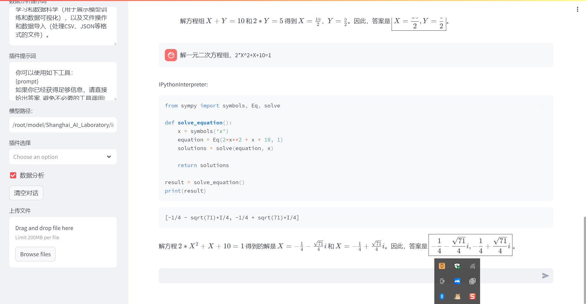

# 笔记

本节课主要体验了书生浦语的大模型趣味 Demo，分为一下几个部分
-   **部署 `InternLM2-Chat-1.8B` 模型进行智能对话**
-   **部署实战营优秀作品 `八戒-Chat-1.8B` 模型**
-   **通过 `InternLM2-Chat-7B` 运行 `Lagent` 智能体 `Demo`**
-   **实践部署 `浦语·灵笔2` 模型**

## 部署 `InternLM2-Chat-1.8B` 模型

使用开发机进行测试 [InternStudio 控制台](https://studio.intern-ai.org.cn/console/dashboard)

### 环境配置
```python
conda create -n demo python==3.10 -y
conda activate demo

conda install pytorch==2.0.1 torchvision==0.15.2 torchaudio==2.0.2 pytorch-cuda=11.7 -c pytorch -c nvidia
pip install huggingface-hub==0.17.3
pip install transformers==4.34 
pip install psutil==5.9.8
pip install accelerate==0.24.1
pip install streamlit==1.32.2 
pip install matplotlib==3.8.3 
pip install modelscope==1.9.5
pip install sentencepiece==0.1.99
```

### 下载模型
```python
import os
from modelscope.hub.snapshot_download import snapshot_download

# 创建保存模型目录
os.system("mkdir /root/models")

# save_dir是模型保存到本地的目录
save_dir="/root/models"

snapshot_download("Shanghai_AI_Laboratory/internlm2-chat-1_8b", 
                  cache_dir=save_dir, 
                  revision='v1.1.0')

```

### 运行 Demo
```python
import torch
from transformers import AutoTokenizer, AutoModelForCausalLM

# 更改为模型路径
model_name_or_path = "/root/models/Shanghai_AI_Laboratory/internlm2-chat-1_8b"

tokenizer = AutoTokenizer.from_pretrained(model_name_or_path, trust_remote_code=True, device_map='cuda:0')
model = AutoModelForCausalLM.from_pretrained(model_name_or_path, trust_remote_code=True, torch_dtype=torch.bfloat16, device_map='cuda:0')
model = model.eval()

system_prompt = """You are an AI assistant whose name is InternLM (书生·浦语).
- InternLM (书生·浦语) is a conversational language model that is developed by Shanghai AI Laboratory (上海人工智能实验室). It is designed to be helpful, honest, and harmless.
- InternLM (书生·浦语) can understand and communicate fluently in the language chosen by the user such as English and 中文.
"""

messages = [(system_prompt, '')]

print("=============Welcome to InternLM chatbot, type 'exit' to exit.=============")

while True:
    input_text = input("\nUser  >>> ")
    input_text = input_text.replace(' ', '')
    if input_text == "exit":
        break

    length = 0
    for response, _ in model.stream_chat(tokenizer, input_text, messages):
        if response is not None:
            print(response[length:], flush=True, end="")
            length = len(response)

```

## 部署实战营优秀作品 八戒-Chat-1.8B 模型

模型地址
-   **八戒-Chat-1.8B：[https://www.modelscope.cn/models/JimmyMa99/BaJie-Chat-mini/summary](https://www.modelscope.cn/models/JimmyMa99/BaJie-Chat-mini/summary)**
-   **Chat-嬛嬛-1.8B：[https://openxlab.org.cn/models/detail/BYCJS/huanhuan-chat-internlm2-1_8b](https://openxlab.org.cn/models/detail/BYCJS/huanhuan-chat-internlm2-1_8b)**
-   **Mini-Horo-巧耳：[https://openxlab.org.cn/models/detail/SaaRaaS/Horowag_Mini](https://openxlab.org.cn/models/detail/SaaRaaS/Horowag_Mini)**

### 下载模型
```bash
git clone https://gitee.com/InternLM/Tutorial -b camp2
# git clone https://github.com/InternLM/Tutorial -b camp2
python /root/Tutorial/helloworld/bajie_download.py
```

bajie_download.py
```python
import os
#模型下载
from modelscope.hub.snapshot_download import snapshot_download

# 创建保存模型目录
os.system("mkdir -p /root/models")

# save_dir是模型保存到本地的目录
save_dir="/root/models"

snapshot_download('JimmyMa99/BaJie-Chat-mini', 
                  cache_dir=save_dir)
```

### 运行模型
```bash
streamlit run /root/Tutorial/helloworld/bajie_chat.py --server.address 127.0.0.1 --server.port 6006
```

bajie_chat.py
```python
# isort: skip_file
import copy
import warnings
from dataclasses import asdict, dataclass
from typing import Callable, List, Optional

import streamlit as st
import torch
from torch import nn
from transformers.generation.utils import (LogitsProcessorList,
                                           StoppingCriteriaList)
from transformers.utils import logging

from transformers import AutoTokenizer, AutoModelForCausalLM  # isort: skip

logger = logging.get_logger(__name__)


@dataclass
class GenerationConfig:
    # this config is used for chat to provide more diversity
    max_length: int = 32768
    top_p: float = 0.8
    temperature: float = 0.8
    do_sample: bool = True
    repetition_penalty: float = 1.005


@torch.inference_mode()
def generate_interactive(
    model,
    tokenizer,
    prompt,
    generation_config: Optional[GenerationConfig] = None,
    logits_processor: Optional[LogitsProcessorList] = None,
    stopping_criteria: Optional[StoppingCriteriaList] = None,
    prefix_allowed_tokens_fn: Optional[Callable[[int, torch.Tensor],
                                                List[int]]] = None,
    additional_eos_token_id: Optional[int] = None,
    **kwargs,
):
    inputs = tokenizer([prompt], padding=True, return_tensors='pt')
    input_length = len(inputs['input_ids'][0])
    for k, v in inputs.items():
        inputs[k] = v.cuda()
    input_ids = inputs['input_ids']
    _, input_ids_seq_length = input_ids.shape[0], input_ids.shape[-1]
    if generation_config is None:
        generation_config = model.generation_config
    generation_config = copy.deepcopy(generation_config)
    model_kwargs = generation_config.update(**kwargs)
    bos_token_id, eos_token_id = (  # noqa: F841  # pylint: disable=W0612
        generation_config.bos_token_id,
        generation_config.eos_token_id,
    )
    if isinstance(eos_token_id, int):
        eos_token_id = [eos_token_id]
    if additional_eos_token_id is not None:
        eos_token_id.append(additional_eos_token_id)
    has_default_max_length = kwargs.get(
        'max_length') is None and generation_config.max_length is not None
    if has_default_max_length and generation_config.max_new_tokens is None:
        warnings.warn(
            f"Using 'max_length''s default ({repr(generation_config.max_length)}) \
                to control the generation length. "
            'This behaviour is deprecated and will be removed from the \
                config in v5 of Transformers -- we'
            ' recommend using `max_new_tokens` to control the maximum \
                length of the generation.',
            UserWarning,
        )
    elif generation_config.max_new_tokens is not None:
        generation_config.max_length = generation_config.max_new_tokens + \
            input_ids_seq_length
        if not has_default_max_length:
            logger.warn(  # pylint: disable=W4902
                f"Both 'max_new_tokens' (={generation_config.max_new_tokens}) "
                f"and 'max_length'(={generation_config.max_length}) seem to "
                "have been set. 'max_new_tokens' will take precedence. "
                'Please refer to the documentation for more information. '
                '(https://huggingface.co/docs/transformers/main/'
                'en/main_classes/text_generation)',
                UserWarning,
            )

    if input_ids_seq_length >= generation_config.max_length:
        input_ids_string = 'input_ids'
        logger.warning(
            f"Input length of {input_ids_string} is {input_ids_seq_length}, "
            f"but 'max_length' is set to {generation_config.max_length}. "
            'This can lead to unexpected behavior. You should consider'
            " increasing 'max_new_tokens'.")

    # 2. Set generation parameters if not already defined
    logits_processor = logits_processor if logits_processor is not None \
        else LogitsProcessorList()
    stopping_criteria = stopping_criteria if stopping_criteria is not None \
        else StoppingCriteriaList()

    logits_processor = model._get_logits_processor(
        generation_config=generation_config,
        input_ids_seq_length=input_ids_seq_length,
        encoder_input_ids=input_ids,
        prefix_allowed_tokens_fn=prefix_allowed_tokens_fn,
        logits_processor=logits_processor,
    )

    stopping_criteria = model._get_stopping_criteria(
        generation_config=generation_config,
        stopping_criteria=stopping_criteria)
    logits_warper = model._get_logits_warper(generation_config)

    unfinished_sequences = input_ids.new(input_ids.shape[0]).fill_(1)
    scores = None
    while True:
        model_inputs = model.prepare_inputs_for_generation(
            input_ids, **model_kwargs)
        # forward pass to get next token
        outputs = model(
            **model_inputs,
            return_dict=True,
            output_attentions=False,
            output_hidden_states=False,
        )

        next_token_logits = outputs.logits[:, -1, :]

        # pre-process distribution
        next_token_scores = logits_processor(input_ids, next_token_logits)
        next_token_scores = logits_warper(input_ids, next_token_scores)

        # sample
        probs = nn.functional.softmax(next_token_scores, dim=-1)
        if generation_config.do_sample:
            next_tokens = torch.multinomial(probs, num_samples=1).squeeze(1)
        else:
            next_tokens = torch.argmax(probs, dim=-1)

        # update generated ids, model inputs, and length for next step
        input_ids = torch.cat([input_ids, next_tokens[:, None]], dim=-1)
        model_kwargs = model._update_model_kwargs_for_generation(
            outputs, model_kwargs, is_encoder_decoder=False)
        unfinished_sequences = unfinished_sequences.mul(
            (min(next_tokens != i for i in eos_token_id)).long())

        output_token_ids = input_ids[0].cpu().tolist()
        output_token_ids = output_token_ids[input_length:]
        for each_eos_token_id in eos_token_id:
            if output_token_ids[-1] == each_eos_token_id:
                output_token_ids = output_token_ids[:-1]
        response = tokenizer.decode(output_token_ids)

        yield response
        # stop when each sentence is finished
        # or if we exceed the maximum length
        if unfinished_sequences.max() == 0 or stopping_criteria(
                input_ids, scores):
            break


def on_btn_click():
    del st.session_state.messages


@st.cache_resource
def load_model():
    model = (AutoModelForCausalLM.from_pretrained('/root/models/JimmyMa99/BaJie-Chat-mini',
                                                  trust_remote_code=True).to(
                                                      torch.bfloat16).cuda())
    tokenizer = AutoTokenizer.from_pretrained('/root/models/JimmyMa99/BaJie-Chat-mini',
                                              trust_remote_code=True)
    return model, tokenizer


def prepare_generation_config():
    with st.sidebar:
        max_length = st.slider('Max Length',
                               min_value=8,
                               max_value=32768,
                               value=32768)
        top_p = st.slider('Top P', 0.0, 1.0, 0.8, step=0.01)
        temperature = st.slider('Temperature', 0.0, 1.0, 0.7, step=0.01)
        st.button('Clear Chat History', on_click=on_btn_click)

    generation_config = GenerationConfig(max_length=max_length,
                                         top_p=top_p,
                                         temperature=temperature)

    return generation_config


user_prompt = '<|im_start|>user\n{user}<|im_end|>\n'
robot_prompt = '<|im_start|>assistant\n{robot}<|im_end|>\n'
cur_query_prompt = '<|im_start|>user\n{user}<|im_end|>\n\
    <|im_start|>assistant\n'


def combine_history(prompt):
    messages = st.session_state.messages
    meta_instruction = ('你是猪八戒，猪八戒说话幽默风趣，说话方式通常表现为直率、幽默，有时带有一点自嘲和调侃。'
                        '你的话语中常常透露出对食物的喜爱和对安逸生活的向往，同时也显示出他机智和有时的懒惰特点。'
                        '尽量保持回答的自然回答，当然你也可以适当穿插一些文言文，另外，书生·浦语是你的好朋友，是你的AI助手。')
    total_prompt = f"<s><|im_start|>system\n{meta_instruction}<|im_end|>\n"
    for message in messages:
        cur_content = message['content']
        if message['role'] == 'user':
            cur_prompt = user_prompt.format(user=cur_content)
        elif message['role'] == 'robot':
            cur_prompt = robot_prompt.format(robot=cur_content)
        else:
            raise RuntimeError
        total_prompt += cur_prompt
    total_prompt = total_prompt + cur_query_prompt.format(user=prompt)
    return total_prompt


def main():
    # torch.cuda.empty_cache()
    print('load model begin.')
    model, tokenizer = load_model()
    print('load model end.')

    st.title('猪猪Chat-InternLM2')

    generation_config = prepare_generation_config()

    # Initialize chat history
    if 'messages' not in st.session_state:
        st.session_state.messages = []

    # Display chat messages from history on app rerun
    for message in st.session_state.messages:
        with st.chat_message(message['role']):
            st.markdown(message['content'])

    # Accept user input
    if prompt := st.chat_input('What is up?'):
        # Display user message in chat message container
        with st.chat_message('user'):
            st.markdown(prompt)
        real_prompt = combine_history(prompt)
        # Add user message to chat history
        st.session_state.messages.append({
            'role': 'user',
            'content': prompt,
        })

        with st.chat_message('robot'):
            message_placeholder = st.empty()
            for cur_response in generate_interactive(
                    model=model,
                    tokenizer=tokenizer,
                    prompt=real_prompt,
                    additional_eos_token_id=92542,
                    **asdict(generation_config),
            ):
                # Display robot response in chat message container
                message_placeholder.markdown(cur_response + '▌')
            message_placeholder.markdown(cur_response)
        # Add robot response to chat history
        st.session_state.messages.append({
            'role': 'robot',
            'content': cur_response,  # pylint: disable=undefined-loop-variable
        })
        torch.cuda.empty_cache()


if __name__ == '__main__':
    main()

```

### streamlit 介绍

[机器学习UI框架Streamlit简介](https://zhuanlan.zhihu.com/p/85741306)
[GitHub streamlit](https://github.com/streamlit/streamlit)
[Turn Python Scripts into Beautiful ML Tools](https://towardsdatascience.com/coding-ml-tools-like-you-code-ml-models-ddba3357eace)

streamlit是一个机器学习工程师专用的应用程序框架
streamlit是一个基于Python的可视化工具，和其他可视化工具不同的是，它生成的是一个可交互的站点（页面）。但同时它又不是我们常接触的类似Django、Flask这样的WEB框架。它有一个优点：无需编写任何HTML、CSS或JS代码就可以生成界面不错的页面

## 通过 `InternLM2-Chat-7B` 运行 `Lagent` 智能体 Demo （需要24G显存）

### 使用 git 命令下载 Lagent 相关的代码库：
```python
git clone https://gitee.com/internlm/lagent.git
git clone https://github.com/internlm/lagent.git
```

### 构造软链接快捷访问方式
```bash
ln -s /root/share/new_models/Shanghai_AI_Laboratory/internlm2-chat-7b /root/models/internlm2-chat-7b
```

### 运行代码
```bash
streamlit run /root/demo/lagent/examples/internlm2_agent_web_demo_hf.py --server.address 127.0.0.1 --server.port 6006
```

## 实践部署 `浦语·灵笔2` 模型 （需要40G显存）

### 浦语灵笔2 介绍

`浦语·灵笔2` 是基于 `书生·浦语2` 大语言模型研发的**图文多模态大模型**，具有非凡的**图文写作和图像理解**能力，在多种应用场景表现出色，总结起来其具有：
-   自由指令输入的**图文写作能力**： `浦语·灵笔2` 可以理解自由形式的图文指令输入，包括大纲、文章细节要求、参考图片等，为用户打造图文并貌的专属文章。生成的文章文采斐然，图文相得益彰，提供沉浸式的阅读体验。
-   准确的**图文问题解答**能力：`浦语·灵笔2` 具有海量图文知识，可以准确的回复各种图文问答难题，在**识别、感知、细节描述、视觉推理**等能力上表现惊人。

### 补充环境包
```python
pip install timm==0.4.12 sentencepiece==0.1.99 markdown2==2.4.10 xlsxwriter==3.1.2 gradio==4.13.0 modelscope==1.9.5
```

### 构造软连接
```bash
ln -s /root/share/new_models/Shanghai_AI_Laboratory/internlm-xcomposer2-7b /root/models/internlm-xcomposer2-7b
ln -s /root/share/new_models/Shanghai_AI_Laboratory/internlm-xcomposer2-vl-7b /root/models/internlm-xcomposer2-vl-7b
```

### 运行图文生成
```python
python /root/demo/InternLM-XComposer/examples/gradio_demo_composition.py  \
--code_path /root/models/internlm-xcomposer2-7b \
--private \
--num_gpus 1 \
--port 6006
```

### 运行图像理解
```python
python /root/demo/InternLM-XComposer/examples/gradio_demo_chat.py  \
--code_path /root/models/internlm-xcomposer2-vl-7b \
--private \
--num_gpus 1 \
--port 6006
```

## 模型下载

### Hugging Face
使用 Hugging Face 官方提供的 huggingface-cli 命令行工具。安装依赖:
```python
pip install -U huggingface_hub
```

然后新建 python 文件，填入以下代码，运行即可，其中 linux 环境下需要填写绝对路径。

	 resume-download：断点续下
	 local-dir：本地存储路径。

```python
import os
# 下载模型

os.system('huggingface-cli download --resume-download internlm/internlm2-chat-7b --local-dir your_path')
```

使用 huggingface_hub 下载模型中的部分文件
```python
import os 
from huggingface_hub import hf_hub_download  # Load model directly 

hf_hub_download(repo_id="internlm/internlm2-7b", filename="config.json")
```

### ModelScope
使用 modelscope 中的 snapshot_download 函数下载模型，第一个参数为模型名称，参数 cache_dir 为模型的下载路径。

注意：cache_dir 最好为绝对路径。

安装依赖：
```python
pip install modelscope==1.9.5
pip install transformers==4.35.2
```

在当前目录下新建 python 文件，填入以下代码，运行即可。
```python
import torch
from modelscope import snapshot_download, AutoModel, AutoTokenizer
import os
model_dir = snapshot_download('Shanghai_AI_Laboratory/internlm2-chat-7b', cache_dir='your path', revision='master')
```

###  OpenXLab
OpenXLab 可以通过指定模型仓库的地址，以及需要下载的文件的名称，文件所需下载的位置等，直接下载模型权重文件，使用 download 函数导入模型中心的模型。
```python
import torch
import os
from transformers import AutoModelForCausalLM, AutoTokenizer, AutoModel
base_path = './local_files'
os.system('apt install git')
os.system('apt install git-lfs')
os.system(f'git clone https://code.openxlab.org.cn/Usr_name/repo_name.git {base_path}')
os.system(f'cd {base_path} && git lfs pull')
```

## 软链接

[浅谈linux中的硬链接和软链接文件以及ln的使用方法](https://blog.csdn.net/LEON1741/article/details/100136449)
[Linux 下软链接和硬链接的区别](https://zhuanlan.zhihu.com/p/88891362)

软连接，其实就是别名，简单的理解就是相当于windows的快捷方式。

### 建立软连接
ln  -s  源目录 目标软连接

注意事项：
	对目录创建软链接之前，不用提前建立好目标目录

​	对目录创建软链接时，不要携带 ’/‘ 符号

​	删除软链接时，不能携带’/'符号，否则你删除的就是软链接目标目录下的资源（即源文件），而不是软链接本身


### 清除方法

当我们建立安全链接之后，如果想要将其删除可以选择以下命令：
```bash
unlink link_name
```

我们举一个例子，当我想删除软链接 /root/demo/internlm2-chat-7b 时：
```bash
cd /root/demo/
unlink internlm2-chat-7b
```

# 作业
## 使用 InternLM-Chat-7B 模型生成 300 字的小故事

根据最近的校园霸凌编写一个正义的小故事，可以看到效果还是很不错的，结尾还有升华。


## 使用 `huggingface_hub` python 包，下载 `InternLM-20B` 的 config.json 文件

```python
import os 
from huggingface_hub import hf_hub_download  # Load model directly 

hf_hub_download(repo_id="internlm/internlm2-7b", filename="config.json")
```

huggingface_hub下载的默认路径是 ~/.cache/huggingface/


## 浦语·灵笔的 Demo 创作部署

### 图文写作

根据以下标题：“现代装修风格”，创作长文章，字数不少于500字。


### 图文理解

可以看到识别的正确率还是很高，但是书名没有识别对，说明OCR方面还有待提高


## Lagent 工具调用 Demo 创作部署

尝试用来解一元二次方程，效果还不错


