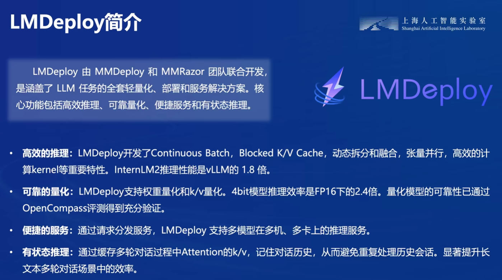
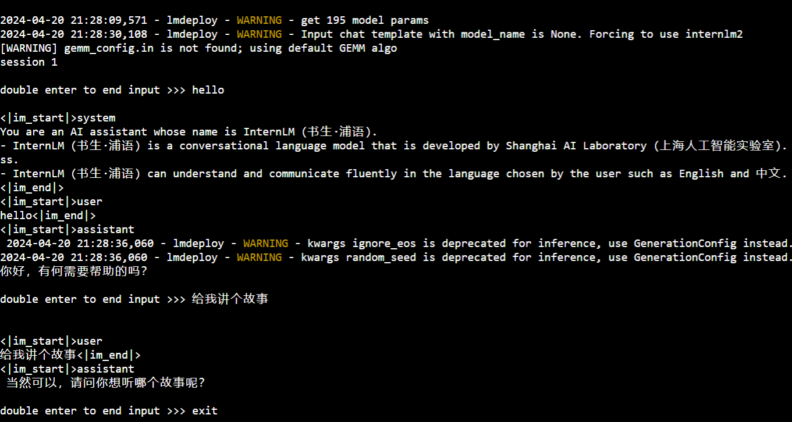

[LMDeploy量化](https://github.com/InternLM/Tutorial/blob/camp2/lmdeploy/README.md)


# 大模型部署的问题

## 大模型计算量巨大


## 模型的内存开销大
- 大模型加载参数需要显存
- 注意力KV会进行缓存，也需要显存
例如20B模型，加载需要40G+显存，推理需要10GB显存，总共需要50G+显存


## 访问显存瓶颈
- 数据交换（显存带宽）瓶颈
- 请求问题（请求数量，时间，Token数量）


# 大模型部署方法

## 模型剪枝 Pruning

移除模型中的冗余参数，减小内存开销


## 知识蒸馏

用大模型（老师）指导训练一个小的模型（学生）


## 量化

将浮点数转换为整型，可以提高速度
并不完全因为转换为整型减小了计算速度，而是通过量化减小了数据交换，需要存储的数据变小了，而提高了速度


# LMDeploy 简介


## LMDeploy 核心功能

### 推理加速
解决了请求问题，KV缓存管理
```python
lmdeploy chat -h
```

### 模型量化压缩
对训练后的模型进行量化压缩（AWQ量化）
```python
lmdeploy lite -h
```

### 服务化部署
可以支持API调用，Trition扩展
```python
lmdeploy serve -h
```

## LMDeploy 支持的模型


# LMDeploy 量化部署 LLM

## 安装lmdeploy

```python
pip install lmdeploy[all]==0.3.0
```

**HuggingFace**

[HuggingFace](https://huggingface.co/)是一个高速发展的社区，包括Meta、Google、Microsoft、Amazon在内的超过5000家组织机构在为HuggingFace开源社区贡献代码、数据集和模型。可以认为是一个针对深度学习模型和数据集的在线托管社区，**如果你有数据集或者模型想对外分享，网盘又不太方便，就不妨托管在HuggingFace**。

托管在HuggingFace社区的模型通常采用HuggingFace格式存储，简写为**HF格式**。

但是HuggingFace社区的服务器在国外，国内访问不太方便。国内可以使用阿里巴巴的[MindScope](https://www.modelscope.cn/home)社区，或者上海AI Lab搭建的[OpenXLab](https://openxlab.org.cn/home)社区，上面托管的模型也通常采用**HF格式**。

**TurboMind**

TurboMind是LMDeploy团队开发的一款**关于LLM推理的高效推理引擎**，它的主要功能包括：LLaMa 结构模型的支持，continuous batch 推理模式和可扩展的 KV 缓存管理器。

TurboMind推理引擎**仅支持推理TurboMind格式的模型**。因此，TurboMind在推理HF格式的模型时，会首先自动将HF格式模型转换为TurboMind格式的模型。**该过程在新版本的LMDeploy中是自动进行的，无需用户操作。**

几个容易迷惑的点：
-   TurboMind与LMDeploy的关系：LMDeploy是涵盖了LLM 任务全套轻量化、部署和服务解决方案的集成功能包，TurboMind是LMDeploy的一个推理引擎，是一个子模块。LMDeploy也可以使用pytorch作为推理引擎。
-   TurboMind与TurboMind模型的关系：TurboMind是推理引擎的名字，TurboMind模型是一种模型存储格式，TurboMind引擎只能推理TurboMind格式的模型

## 下载模型

```python
ln -s /root/share/new_models/Shanghai_AI_Laboratory/internlm2-chat-1_8b /root/
```

## 运行模型

### 使用 Transformer 库
```python
import torch
from transformers import AutoTokenizer, AutoModelForCausalLM

tokenizer = AutoTokenizer.from_pretrained("/root/internlm2-chat-1_8b", trust_remote_code=True)

# Set `torch_dtype=torch.float16` to load model in float16, otherwise it will be loaded as float32 and cause OOM Error.
model = AutoModelForCausalLM.from_pretrained("/root/internlm2-chat-1_8b", torch_dtype=torch.float16, trust_remote_code=True).cuda()
model = model.eval()

inp = "hello"
print("[INPUT]", inp)
response, history = model.chat(tokenizer, inp, history=[])
print("[OUTPUT]", response)

inp = "please provide three suggestions about time management"
print("[INPUT]", inp)
response, history = model.chat(tokenizer, inp, history=history)
print("[OUTPUT]", response)
```


大概推理时间在5-6s

### 使用 LMDeploy

使用LMDeploy与模型进行对话的通用命令格式为：

```python
lmdeploy chat [HF格式模型路径/TurboMind格式模型路径]
```

例如，您可以执行如下命令运行下载的1.8B模型：

```python
lmdeploy chat /root/models/internlm2-chat-1_8b
```

可以感受到速度确实快了不少，大概3s左右


有关LMDeploy的chat功能的更多参数可通过-h命令查看。

```python
lmdeploy chat -h
```

## LMDeploy 量化(lite)

### 主要的量化方式

主要包括 **KV8量化**和**W4A16量化**。总的来说，量化是一种以参数或计算中间结果精度下降换空间节省（以及同时带来的性能提升）的策略。

正式介绍 LMDeploy 量化方案前，需要先介绍两个概念：
-   计算密集（compute-bound）: 指推理过程中，绝大部分时间消耗在数值计算上；针对计算密集型场景，可以通过使用更快的硬件计算单元来提升计算速度。
-   访存密集（memory-bound）: 指推理过程中，绝大部分时间消耗在数据读取上；针对访存密集型场景，一般通过减少访存次数、提高计算访存比或降低访存量来优化。

常见的 LLM 模型由于 Decoder Only 架构的特性，实际推理时大多数的时间都消耗在了逐 Token 生成阶段（Decoding 阶段），是典型的**访存密集型场景**。那么，如何优化 LLM 模型推理中的访存密集问题呢？ 我们可以使用**KV8量化**和**W4A16**量化。

**KV8量化**是指将逐 Token（Decoding）生成过程中的上下文 **K 和 V 中间结果**进行 **INT8** 量化（**计算时再反量化**），以降低生成过程中的显存占用。
**W4A16 量化**，**将 FP16 的模型权重量化为 INT4**，Kernel 计算时，访存量直接降为 FP16 模型的 1/4，大幅降低了访存成本。Weight Only 是指仅量化权重，数值计算依然采用 FP16（需要将 INT4 权重反量化）。

### 设置最大KV Cache缓存大小

KV Cache是一种缓存技术，通过存储键值对的形式来复用计算结果，以达到提高性能和降低内存消耗的目的。在大规模训练和推理中，KV Cache可以显著减少重复计算量，从而提升模型的推理速度。理想情况下，KV Cache全部存储于显存，以加快访存速度。当显存空间不足时，也**可以将KV Cache放在内存**，通过缓存管理器控制将当前需要使用的数据放入显存。

模型在运行时，占用的显存可大致分为三部分：**模型参数本身占用的显存、KV Cache占用的显存，以及中间运算结果占用的显存**。LMDeploy的KV Cache管理器可以通过设置`--cache-max-entry-count`参数，控制KV缓存**占用剩余显存**的最大比例。默认的比例为0.8。

改变`--cache-max-entry-count`参数，设为0.5。
```python
lmdeploy chat /root/internlm2-chat-1_8b --cache-max-entry-count 0.5
```

### 使用W4A16量化

LMDeploy使用AWQ算法，实现模型4bit权重量化。推理引擎TurboMind提供了非常高效的4bit推理cuda kernel，性能是FP16的2.4倍以上。

运行前，首先安装一个依赖库。
```python
pip install einops==0.7.0
```

仅需执行一条命令，就可以完成模型量化工作。
```python
lmdeploy lite auto_awq \
   /root/internlm2-chat-1_8b \
  --calib-dataset 'ptb' \
  --calib-samples 128 \
  --calib-seqlen 1024 \
  --w-bits 4 \
  --w-group-size 128 \
  --work-dir /root/models/internlm2-chat-1_8b-4bit
```

面使用Chat功能运行W4A16量化后的模型。
```python
lmdeploy chat /root/internlm2-chat-1_8b-4bit --model-format awq
```

有关LMDeploy的lite功能的更多参数可通过-h命令查看。
```python
lmdeploy lite -h
```

## LMDeploy 服务(serve)

在生产环境下，我们有时会将大模型封装为API接口服务，供客户端访问。


我们把从架构上把整个服务流程分成下面几个模块。
-   **模型推理/服务**。主要提供**模型本身的推理**，一般来说可以和具体业务解耦，专注模型推理本身性能的优化。可以以模块、API等多种方式提供。
-   **API Server**。中间协议层，把后端推理/服务通过HTTP，gRPC或其他形式的接口，供前端调用。
-   **Client**。可以理解为前端，**与用户交互的地方**。通过通过网页端/命令行去调用API接口，获取模型推理/服务。

### 启动API服务器

```python
lmdeploy serve api_server \
    /root/models/internlm2-chat-1_8b \
    --model-format hf \
    --quant-policy 0 \
    --server-name 0.0.0.0 \
    --server-port 23333 \
    --tp 1
```

其中，model-format、quant-policy这些参数是与第三章中量化推理模型一致的；server-name和server-port表示API服务器的服务IP与服务端口；tp参数表示并行数量（GPU数量）。

可以通过运行一下指令，查看更多参数及使用方法：
```python
lmdeploy serve api_server -h
```

命令行客户端连接API服务器

```python
lmdeploy serve api_client http://localhost:23333
```


网页客户端连接API服务器

```python
lmdeploy serve gradio http://localhost:23333 \
    --server-name 0.0.0.0 \
    --server-port 6006
```


## python 代码集成

新建Python源代码文件`pipeline.py`。

```python
touch /root/pipeline.py
```

打开`pipeline.py`，填入以下内容。

```python
from lmdeploy import pipeline

pipe = pipeline('/root/models/internlm2-chat-1_8b')
response = pipe(['Hi, pls intro yourself', '上海是'])
print(response)
```

> **代码解读**：\
> 
> -   第1行，引入lmdeploy的pipeline模块 \
> -   第3行，从目录“./internlm2-chat-1_8b”加载HF模型 \
> -   第4行，运行pipeline，这里采用了批处理的方式，用一个列表包含两个输入，lmdeploy同时推理两个输入，产生两个输出结果，结果返回给response \
> -   第5行，输出response

保存后运行代码文件：

```python
python /root/pipeline.py
```

### 调整 KV cache

我们通过向lmdeploy传递附加参数，实现模型的量化推理，及设置KV Cache最大占用比例。在Python代码中，可以通过创建TurbomindEngineConfig，向lmdeploy传递参数。

以设置KV Cache占用比例为例，新建python文件`pipeline_kv.py`。

```python
touch /root/pipeline_kv.py
```

打开`pipeline_kv.py`，填入如下内容：

```python
from lmdeploy import pipeline, TurbomindEngineConfig

# 调低 k/v cache内存占比调整为总显存的 20%
backend_config = TurbomindEngineConfig(cache_max_entry_count=0.2)

pipe = pipeline('/root/internlm2-chat-1_8b',
                backend_config=backend_config)
response = pipe(['Hi, pls intro yourself', '上海是'])
print(response)
```

保存后运行python代码：

```python
python /root/pipeline_kv.py
```

# LMDeploy 量化部署 VLM

安装依赖库
```python
pip install git+https://github.com/haotian-liu/LLaVA.git@4e2277a060da264c4f21b364c867cc622c945874
```

新建一个python文件，比如`pipeline_llava.py`。

```
touch /root/pipeline_llava.py
```

打开`pipeline_llava.py`，填入内容如下：

```python
from lmdeploy.vl import load_image
from lmdeploy import pipeline, TurbomindEngineConfig

backend_config = TurbomindEngineConfig(session_len=8192) # 图片分辨率较高时请调高session_len
# pipe = pipeline('liuhaotian/llava-v1.6-vicuna-7b', backend_config=backend_config) 非开发机运行此命令
pipe = pipeline('/share/new_models/liuhaotian/llava-v1.6-vicuna-7b', backend_config=backend_config)

image = load_image('https://raw.githubusercontent.com/open-mmlab/mmdeploy/main/tests/data/tiger.jpeg')
response = pipe(('describe this image', image))
print(response)
```

> **代码解读**： \
> 
> -   第1行引入用于载入图片的load_image函数，第2行引入了lmdeploy的pipeline模块， \
> -   第5行创建了pipeline实例 \
> -   第7行从github下载了一张关于老虎的图片，如下：  
>     [](https://github.com/InternLM/Tutorial/blob/camp2/lmdeploy/imgs/6.1_1.jpg) \
> -   第8行运行pipeline，输入提示词“describe this image”，和图片，结果返回至response \
> -   第9行输出response

我们也可以通过Gradio来运行llava模型。新建python文件`gradio_llava.py`。

```
touch /root/gradio_llava.py
```

打开文件，填入以下内容：

```python
import gradio as gr
from lmdeploy import pipeline, TurbomindEngineConfig

backend_config = TurbomindEngineConfig(session_len=8192) # 图片分辨率较高时请调高session_len
# pipe = pipeline('liuhaotian/llava-v1.6-vicuna-7b', backend_config=backend_config) 非开发机运行此命令
pipe = pipeline('/share/new_models/liuhaotian/llava-v1.6-vicuna-7b', backend_config=backend_config)

def model(image, text):
    if image is None:
        return [(text, "请上传一张图片。")]
    else:
        response = pipe((text, image)).text
        return [(text, response)]

demo = gr.Interface(fn=model, inputs=[gr.Image(type="pil"), gr.Textbox()], outputs=gr.Chatbot())
demo.launch()
```

# 作业

## 基础作业 以命令行方式与 InternLM2-Chat-1.8B 模型对话


输入以下命令
```python
lmdeploy chat /root/models/internlm2-chat-1_8b
```

询问了两个问题，平均回复在3s左右，还是很快的，就是启动比较耗时


## 进阶作业 1 

设置KV Cache最大占用比例为0.4，开启W4A16量化，以命令行方式与模型对话

量化完成后，输入以下命令
```python
lmdeploy chat /root/models/internlm2-chat-1_8b-4bit --model-format awq --cache-max-entry-count 0.4
```

显存占用大概在 40%


这个速度太快了，无敌


## 进阶作业 2

以API Server方式启动 lmdeploy，开启 W4A16量化，调整KV Cache的占用比例为0.4，分别使用命令行客户端与Gradio网页客户端与模型对话。

在服务器端输入以下命令
```python
lmdeploy serve api_server \
    /root/models/internlm2-chat-1_8b-4bit \
    --model-format hf \
    --quant-policy 0 \
    --server-name 0.0.0.0 \
    --server-port 23333 \
    --tp 1 \
	--model-format awq \
	--cache-max-entry-count 0.4
```

在客户端输入以下命令
```python
lmdeploy serve gradio http://localhost:23333 \
    --server-name 0.0.0.0 \
    --server-port 6006
```

最终效果如图，显存占用大概40 %和上面作业相同


速度依旧还是非常快的


## 进阶作业 3 

使用W4A16量化，调整KV Cache的占用比例为0.4，使用Python代码集成的方式运行internlm2-chat-1.8b模型。

在pipeline_kv.py输入以下文本

```python
from lmdeploy import pipeline, TurbomindEngineConfig

# 调低 k/v cache内存占比调整为总显存的 40%
backend_config = TurbomindEngineConfig(cache_max_entry_count=0.4,model_format='awq')

pipe = pipeline('/root/models/internlm2-chat-1_8b-4bit',

                backend_config=backend_config)

response = pipe(['Hi, pls intro yourself', '上海是'])

print(response)
```

最终效果如下图


## 进阶作业 4

使用 LMDeploy 运行视觉多模态大模型 llava gradio demo

果然中文就在胡说八道了
