[Lagent & AgentLego 智能体应用搭建](https://github.com/InternLM/Tutorial/blob/camp2/agent/README.md)

# 智能体简介
## 为什么要有智能体
- **幻觉**，大模型会生成虚假信息
- **时效性**：模型训练数据过时，无法反映最新的趋势信息
- **可靠性**：面对复杂任务会频发错误输出，影响信任度

## 什么是智能体
- 可以**感知**环境中的**动态条件**
- 能**采取动作影响环境**
- 能运用**推理能力理解信息、解决问题、产生推断、决定动作**

## 智能体组成
- **大脑**：作为控制器，承担记忆思考和决策，接受来自感知模块的信息，并采取相应动作
- **感知**：对外部环境的多模态信息进行感知处理。包括但不限于音视频、传感器等
- **动作**：利用执行工具影响环境。工具可以是检索文本、调用API、控制机械臂等‘

# 典型的智能体范式

## AutoGPT
1. 用户发送目标和任务
2. 任务列表 Task Queue 将任务和目标发送给智能体 Excution Agent (GPT-4)
3. 智能体执行任务后，会将相关的**任务/结果对**存储到记忆当中，并且把相关的结果发送到另外一个智能体 Task Creatioin Agent
4. 这个智能体再创建新的任务
依此循环直到完成任务
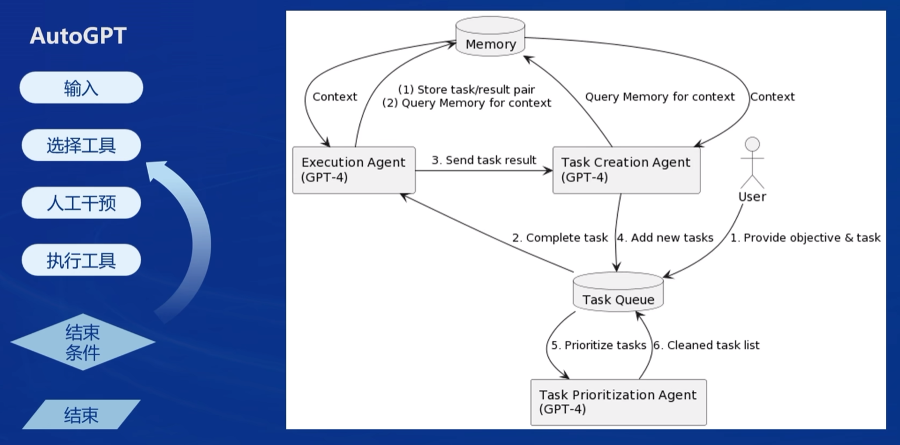

### ReWoo
Planner将决策划分为多步，每步都对应着相应的决策
然后启动 worker 进行执行
最终两部分的内容合并发送给 solver 得到结果
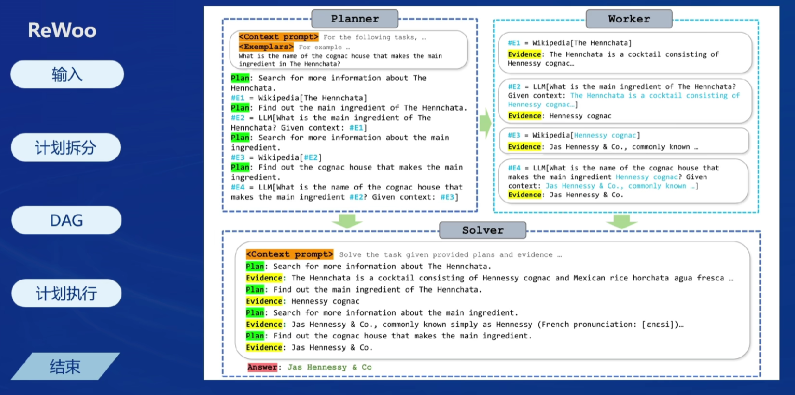

## ReAct

接受用户输入后会选择相应的工具进行执行
模型执行结束后会进一步思考是否选择下一个工具进行执行，直到达到结束条件为止
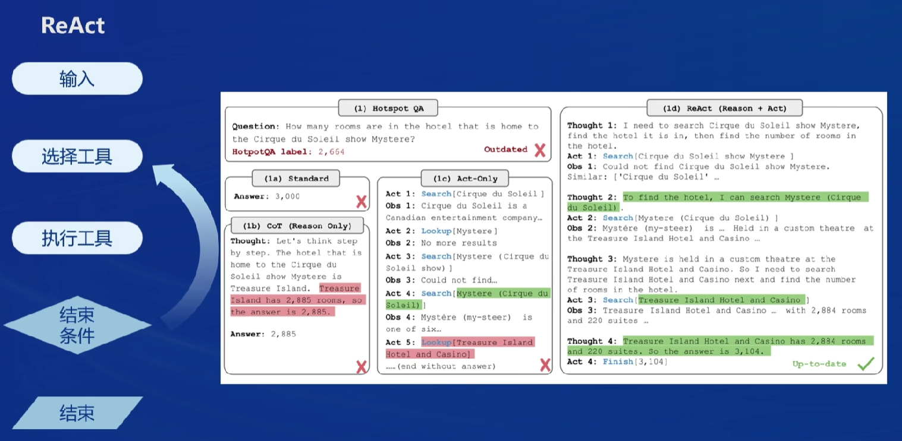

# Lagent 简介

[Lagent：轻量级智能体框架](https://github.com/InternLM/Tutorial/blob/camp2/agent/lagent.md)

Lagent 是一个**轻量级开源智能体框架**，旨在让用户可以高效地构建基于大语言模型的智能体。同时它也提供了一些典型工具以增强大语言模型的能力。
Lagent 目前已经**支持了包括 AutoGPT、ReAct 等在内的多个经典智能体范式**，也支持了如下工具：
-   Arxiv 搜索
-   Bing 地图
-   Google 学术搜索
-   Google 搜索
-   交互式 IPython 解释器
-   IPython 解释器
-   PPT
-   Python 解释器


## 基于 Lagent 自定义一个工具

Lagent 中关于工具部分的介绍文档位于 [https://lagent.readthedocs.io/zh-cn/latest/tutorials/action.html](https://lagent.readthedocs.io/zh-cn/latest/tutorials/action.html) 。使用 Lagent 自定义工具主要分为以下几步：
1.  继承 BaseAction 类
2.  实现简单工具的 run 方法；或者实现工具包内每个子工具的功能
3.  简单工具的 run 方法可选被 tool_api 装饰；工具包内每个子工具的功能都需要被 tool_api 装饰

# AgentLego 简介

AgentLego 是一个提供了**多种开源工具 API 的多模态工具包**，旨在像是乐高积木一样，让用户可以快速简便地**拓展自定义工具**，从而组装出自己的智能体。
通过 AgentLego 算法库，不仅可以直接使用多种工具，也可以利用这些工具，在相关智能体框架（如 Lagent，Transformers Agent 等）的帮助下，快速构建可以增强大语言模型能力的智能体。
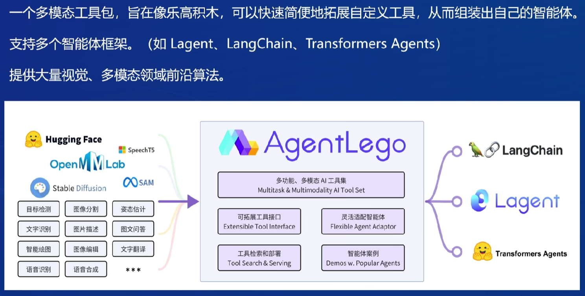

AgentLego 目前提供了如下工具：
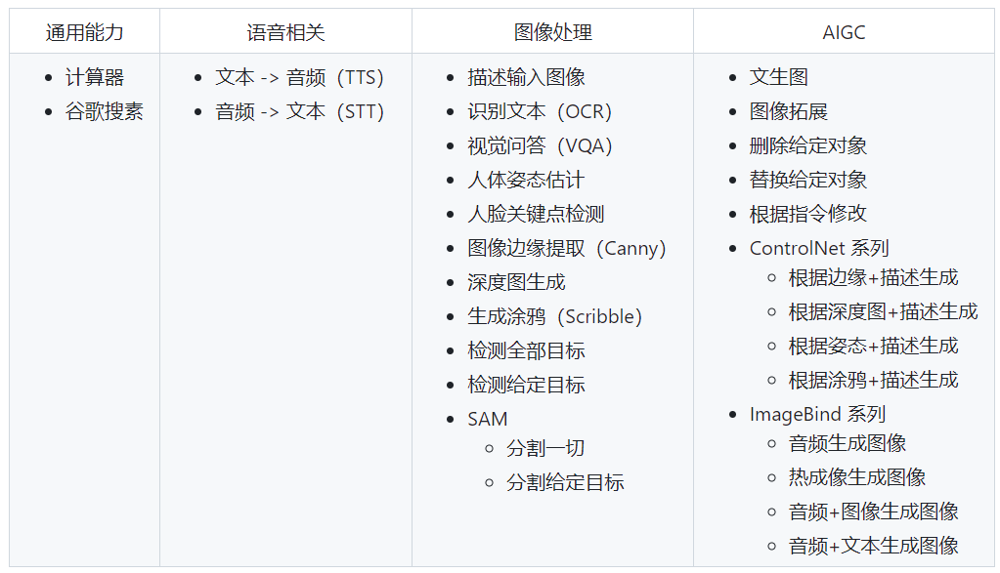

## AgentLego 自定义工具

我们将基于 AgentLego 构建自己的自定义工具。AgentLego 在这方面提供了较为详尽的文档，文档地址为 [https://agentlego.readthedocs.io/zh-cn/latest/modules/tool.html](https://agentlego.readthedocs.io/zh-cn/latest/modules/tool.html) 。自定义工具主要分为以下几步：
1.  继承 BaseTool 类
2.  修改 default_desc 属性（工具功能描述）
3.  如有需要，重载 setup 方法（重型模块延迟加载）
4.  重载 apply 方法（工具功能实现）
其中第**一二四步是必须的步骤**。

# Lagent 和 AgentLego 关系

Lagent 是一个**智能体框架**，而 AgentLego 与大模型智能体并不直接相关，而是作为**工具包**，在相关智能体的功能支持模块发挥作用。


# Lagent：轻量级智能体框架

## 作业1 Lagent Web Demo

### 使用 LMDeploy 部署

由于 Lagent 的 Web Demo 需要用到 LMDeploy 所启动的 api_server，因此我们首先按照下图指示在 vscode terminal 中执行如下代码使用 LMDeploy 启动一个 api_server。

```python
#conda activate agent
lmdeploy serve api_server /root/share/new_models/Shanghai_AI_Laboratory/internlm2-chat-7b \
                            --server-name 127.0.0.1 \
                            --model-name internlm2-chat-7b \
                            --cache-max-entry-count 0.1
```

### 启动并使用 Lagent Web Demo

```python
cd /root/agent/lagent/examples
streamlit run internlm2_agent_web_demo.py --server.address 127.0.0.1 --server.port 7860
```

接下来在本地的浏览器页面中打开 [http://localhost:7860](http://localhost:7860/) 以使用 Lagent Web Demo。首先**输入模型 IP 为 127.0.0.1:23333**，**在输入完成后按下回车键以确认**。并**选择插件为 ArxivSearch**，以让模型获得在 arxiv 上搜索论文的能力。

输入“请帮我搜索 InternLM2 Technical Report”得到如下回答


测试下看看能不能查询其他论文“ attention is all your need”，可以看到也能返回


## 进阶作业2 用 Lagent 自定义工具

调用和风天气 API 的工具以完成实时天气查询的功能

首先通过 `touch /root/agent/lagent/lagent/actions/weather.py`（大小写敏感）新建工具文件
```python
import json
import os
import requests
from typing import Optional, Type

from lagent.actions.base_action import BaseAction, tool_api
from lagent.actions.parser import BaseParser, JsonParser
from lagent.schema import ActionReturn, ActionStatusCode

class WeatherQuery(BaseAction):
    """Weather plugin for querying weather information."""
    
    def __init__(self,
                 key: Optional[str] = None,
                 description: Optional[dict] = None,
                 parser: Type[BaseParser] = JsonParser,
                 enable: bool = True) -> None:
        super().__init__(description, parser, enable)
        key = os.environ.get('WEATHER_API_KEY', key)
        if key is None:
            raise ValueError(
                'Please set Weather API key either in the environment '
                'as WEATHER_API_KEY or pass it as `key`')
        self.key = key
        self.location_query_url = 'https://geoapi.qweather.com/v2/city/lookup'
        self.weather_query_url = 'https://devapi.qweather.com/v7/weather/now'

    @tool_api
    def run(self, query: str) -> ActionReturn:
        """一个天气查询API。可以根据城市名查询天气信息。
        
        Args:
            query (:class:`str`): The city name to query.
        """
        tool_return = ActionReturn(type=self.name)
        status_code, response = self._search(query)
        if status_code == -1:
            tool_return.errmsg = response
            tool_return.state = ActionStatusCode.HTTP_ERROR
        elif status_code == 200:
            parsed_res = self._parse_results(response)
            tool_return.result = [dict(type='text', content=str(parsed_res))]
            tool_return.state = ActionStatusCode.SUCCESS
        else:
            tool_return.errmsg = str(status_code)
            tool_return.state = ActionStatusCode.API_ERROR
        return tool_return
    
    def _parse_results(self, results: dict) -> str:
        """Parse the weather results from QWeather API.
        
        Args:
            results (dict): The weather content from QWeather API
                in json format.
        
        Returns:
            str: The parsed weather results.
        """
        now = results['now']
        data = [
            f'数据观测时间: {now["obsTime"]}',
            f'温度: {now["temp"]}°C',
            f'体感温度: {now["feelsLike"]}°C',
            f'天气: {now["text"]}',
            f'风向: {now["windDir"]}，角度为 {now["wind360"]}°',
            f'风力等级: {now["windScale"]}，风速为 {now["windSpeed"]} km/h',
            f'相对湿度: {now["humidity"]}',
            f'当前小时累计降水量: {now["precip"]} mm',
            f'大气压强: {now["pressure"]} 百帕',
            f'能见度: {now["vis"]} km',
        ]
        return '\n'.join(data)

    def _search(self, query: str):
        # get city_code
        try:
            city_code_response = requests.get(
                self.location_query_url,
                params={'key': self.key, 'location': query}
            )
        except Exception as e:
            return -1, str(e)
        if city_code_response.status_code != 200:
            return city_code_response.status_code, city_code_response.json()
        city_code_response = city_code_response.json()
        if len(city_code_response['location']) == 0:
            return -1, '未查询到城市'
        city_code = city_code_response['location'][0]['id']
        # get weather
        try:
            weather_response = requests.get(
                self.weather_query_url,
                params={'key': self.key, 'location': city_code}
            )
        except Exception as e:
            return -1, str(e)
        return weather_response.status_code, weather_response.json()
```

为了获得稳定的天气查询服务，我们首先要获取 API KEY。首先打开 [https://dev.qweather.com/docs/api/](https://dev.qweather.com/docs/api/) 后，点击右上角控制台项目管理进行操作

服务器端打开
```python
lmdeploy serve api_server /root/share/new_models/Shanghai_AI_Laboratory/internlm2-chat-7b \
                            --server-name 127.0.0.1 \
                            --model-name internlm2-chat-7b \
                            --cache-max-entry-count 0.1
```

客户端先保存 weather-api-key再运行代码
/root/agent/Tutorial/agent/internlm2_weather_web_demo.py 中会调用 WeatherQuery工具 `from lagent.actions.weather import WeatherQuery`
```python
export WEATHER_API_KEY=在2.2节获取的API KEY
conda activate agent
cd /root/agent/Tutorial/agent
streamlit run internlm2_weather_web_demo.py --server.address 127.0.0.1 --server.port 7860
```

首先**输入模型 IP 为 127.0.0.1:23333**，**在输入完成后按下回车键以确认**。并**选择插件为 WeatherQuery**，以让模型获得搜索天气的能力。

搜索杭州市的天气，速度还是蛮快的


接着搜索了上海市的天气
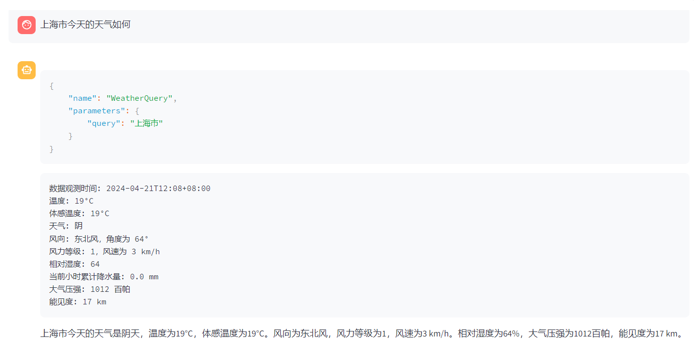


进行对比，可以看到详细对比没想数据，还不错
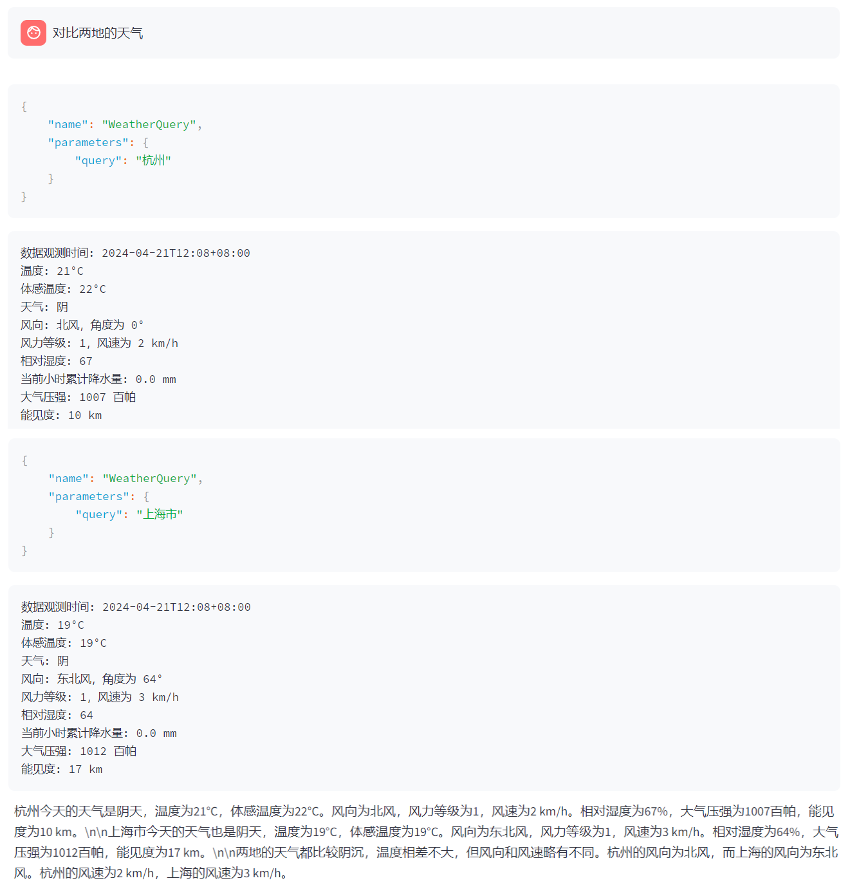

# AgentLego：组装智能体“乐高”

[AgentLego：组装智能体“乐高”](https://github.com/InternLM/Tutorial/blob/camp2/agent/agentlego.md)

## 作业2 直接使用AgentLego

由于 AgentLego 在安装时并不会安装某个特定工具的依赖，因此我们接下来准备安装目标检测工具运行时所需依赖。

AgentLego 所实现的目标检测工具是基于 mmdet (MMDetection) 算法库中的 RTMDet-Large 模型，因此我们首先安装 mim，然后通过 mim 工具来安装 mmdet。这一步所需时间可能会较长，请耐心等待。

```
cd /root/agent
wget http://download.openmmlab.com/agentlego/road.jpg
conda activate agent
pip install openmim==0.3.9
mim install mmdet==3.3.0
```

然后通过 `touch /root/agent/direct_use.py`（大小写敏感）的方式在 /root/agent 目录下新建 direct_use.py 以直接使用目标检测工具，direct_use.py 的代码如下：
```python
import re
import cv2
from agentlego.apis import load_tool

# load tool
tool = load_tool('ObjectDetection', device='cuda')

# apply tool
visualization = tool('/root/agent/road.jpg')
print(visualization)

# visualize
image = cv2.imread('/root/agent/road.jpg')

preds = visualization.split('\n')
pattern = r'(\w+) \((\d+), (\d+), (\d+), (\d+)\), score (\d+)'

for pred in preds:
    name, x1, y1, x2, y2, score = re.match(pattern, pred).groups()
    x1, y1, x2, y2, score = int(x1), int(y1), int(x2), int(y2), int(score)
    cv2.rectangle(image, (x1, y1), (x2, y2), (0, 255, 0), 1)
    cv2.putText(image, f'{name} {score}', (x1, y1), cv2.FONT_HERSHEY_SIMPLEX, 0.8, (0, 255, 0), 1)

cv2.imwrite('/root/agent/road_detection_direct.jpg', image)
```

此时文件树结构如下：
```
/root/agent
├── agentlego
│   ├── agentlego
│   ├── docs
│   ├── examples
│   ├── LICENSE
│   └── ...
├── lagent
│   ├── docs
│   ├── examples
│   ├── lagent
│   ├── LICENSE
│   └── ...
├── Tutorial
│   ├── assets
│   ├── agent
│   ├── helloword
│   ├── huixiangdou
│   └── ...
├── direct_use.py
└── road.jpg
```

接下来在执行 `python /root/agent/direct_use.py` 以进行推理。在等待 RTMDet-Large 权重下载并推理完成后，我们就可以看到如下输出以及一张位于 /root/agent 名为 road_detection_direct.jpg 的图片
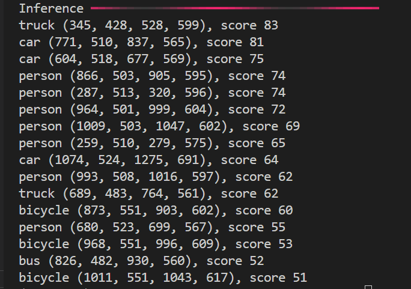


## 进阶作业1 作为智能体工具使用

 AgentLego 算法库默认使用 InternLM2-Chat-20B 模型，因此我们首先需要修改 /root/agent/agentlego/webui/modules/agents/lagent_agent.py 文件的第 105行位置，将 model_name='internlm2-chat-20b' 修改为 model_name='internlm2-chat-7b'

启动 LMDeploy 部署

```python
conda activate agent
lmdeploy serve api_server /root/share/new_models/Shanghai_AI_Laboratory/internlm2-chat-7b \
                            --server-name 127.0.0.1 \
                            --model-name internlm2-chat-7b \
                            --cache-max-entry-count 0.1
```

### 启动 AgentLego WebUI

接下来我们按照下图指示新建一个 terminal 以启动 AgentLego WebUI。在新建的 terminal 中执行如下指令：

```python
conda activate agent
cd /root/agent/agentlego/webui
python one_click.py
```

首先来配置 Agent，如下图所示。
1.  点击上方 Agent 进入 Agent 配置页面。（如①所示）
2.  点击 Agent 下方框，选择 New Agent。（如②所示）
3.  选择 Agent Class 为 lagent.InternLM2Agent。（如③所示）
4.  输入模型 URL 为 [http://127.0.0.1:23333](http://127.0.0.1:23333/) 。（如④所示）
5.  输入 Agent name，自定义即可，图中输入了 internlm2。（如⑤所示）
6.  点击 save to 以保存配置，这样在下次使用时只需在第2步时选择 Agent 为 internlm2 后点击 load 以加载就可以了。（如⑥所示）
7.  点击 load 以加载配置。（如⑦所示）
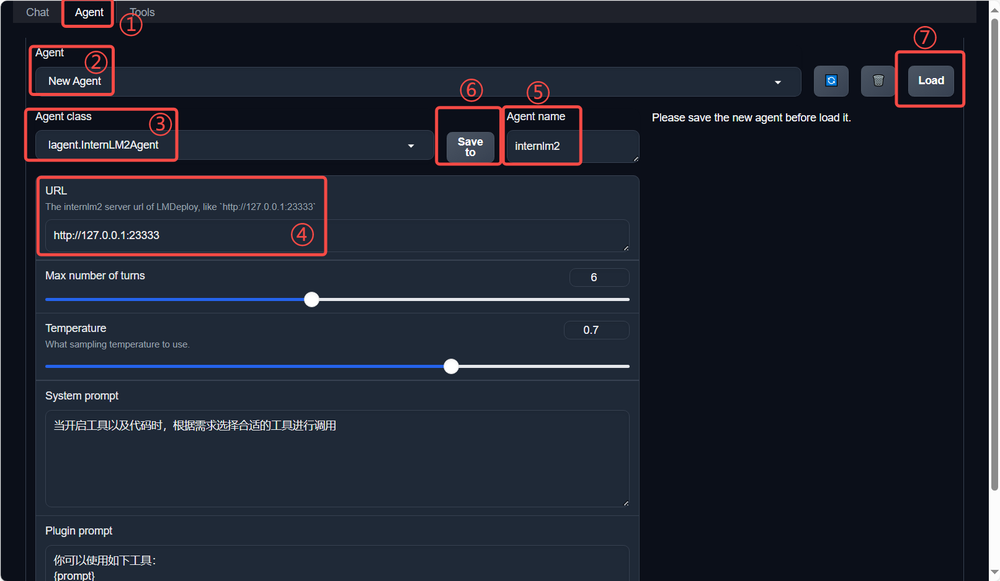

然后配置工具，如下图所示。
1.  点击上方 Tools 页面进入工具配置页面。（如①所示）
2.  点击 Tools 下方框，选择 New Tool 以加载新工具。（如②所示）
3.  选择 Tool Class 为 ObjectDetection。（如③所示）
4.  点击 save 以保存配置。（如④所示）
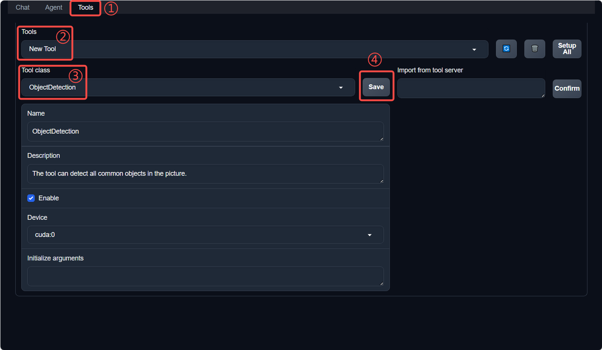

等待工具加载完成后，点击上方 Chat 以进入对话页面。在页面下方选择工具部分只选择 ObjectDetection 工具，如下图所示。为了确保调用工具的成功率，请在使用时确保仅有这一个工具启用。


点击右下角文件夹以上传图片，上传图片后输入指令“请检测图中物体”并点击 generate 以得到模型回复。如下图所示
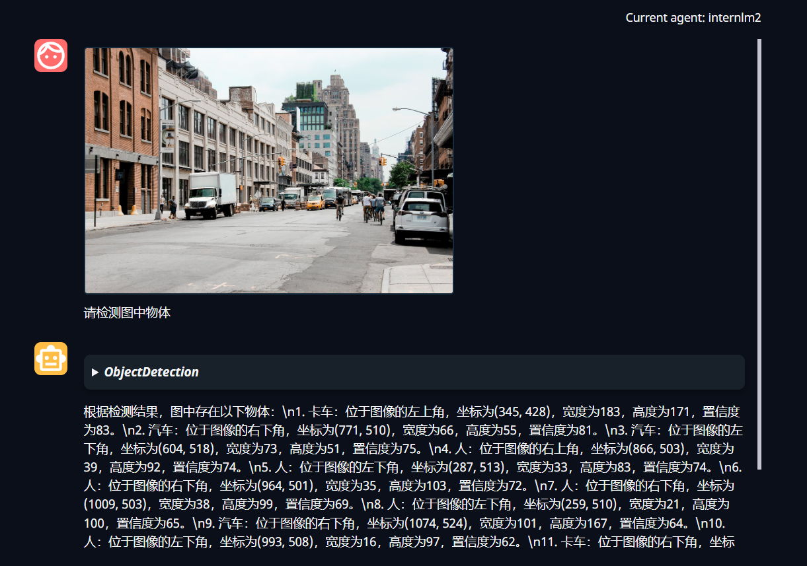

尝试上传别的图片，回答还是非常不错的


```
1. 瓶子：位于图像的左上角，坐标为(183, 102)，宽度为95，高度为408，置信度为89。 
2. 沙发：位于图像的右下角，坐标为(547, 0)，宽度为661，高度为427，置信度为83。 
3. 花瓶：位于图像的右下角，坐标为(679, 304)，宽度为200，高度为261，置信度为82。 
4. 酒杯：位于图像的右下角，坐标为(405, 266)，宽度为77，高度为224，置信度为79。 
5. 餐桌：位于图像的左下角，坐标为(0, 342)，宽度为1206，高度为406，置信度为74。 
6. 书本：位于图像的左下角，坐标为(566, 475)，宽度为404，高度为152，置信度为58。 
7. 书本：位于图像的右下角，坐标为(547, 535)，宽度为419，高度=153，置信度为56。 
8. 碗：位于图像的左下角，坐标为(162, 479)，宽度为371，高度=194，置信度为56。
9. 椅子：位于图像的左下角，坐标为(0, 190)，宽度为84，高度=270，置信度为55。 
10. 盆栽：位于图像的右下角，坐标为(556, 117)，宽度为448，高度=448，置信度为50。
```


## 进阶作业2 用 AgentLego 自定义工具

下面我们将实现一个调用 MagicMaker 的 API 以实现**图像生成**的工具。

MagicMaker 是汇聚了优秀 AI 算法成果的免费 AI 视觉素材生成与创作平台。主要提供图像生成、图像编辑和视频生成三大核心功能，全面满足用户在各种应用场景下的视觉素材创作需求。体验更多功能可以访问 [https://magicmaker.openxlab.org.cn/home](https://magicmaker.openxlab.org.cn/home) 。

首先通过 `touch /root/agent/agentlego/agentlego/tools/magicmaker_image_generation.py`（大小写敏感）的方法新建工具文件。该文件的内容如下：
```python
import json
import requests
import numpy as np

from agentlego.types import Annotated, ImageIO, Info
from agentlego.utils import require
from .base import BaseTool

class MagicMakerImageGeneration(BaseTool):

    default_desc = ('This tool can call the api of magicmaker to '
                    'generate an image according to the given keywords.')

    styles_option = [
        'dongman',  # 动漫
        'guofeng',  # 国风
        'xieshi',   # 写实
        'youhua',   # 油画
        'manghe',   # 盲盒
    ]
    aspect_ratio_options = [
        '16:9', '4:3', '3:2', '1:1',
        '2:3', '3:4', '9:16'
    ]

    @require('opencv-python')
    def __init__(self,
                 style='guofeng',
                 aspect_ratio='4:3'):
        super().__init__()
        if style in self.styles_option:
            self.style = style
        else:
            raise ValueError(f'The style must be one of {self.styles_option}')
        
        if aspect_ratio in self.aspect_ratio_options:
            self.aspect_ratio = aspect_ratio
        else:
            raise ValueError(f'The aspect ratio must be one of {aspect_ratio}')

    def apply(self,
              keywords: Annotated[str,
                                  Info('A series of Chinese keywords separated by comma.')]
        ) -> ImageIO:
        import cv2
        response = requests.post(
            url='https://magicmaker.openxlab.org.cn/gw/edit-anything/api/v1/bff/sd/generate',
            data=json.dumps({
                "official": True,
                "prompt": keywords,
                "style": self.style,
                "poseT": False,
                "aspectRatio": self.aspect_ratio
            }),
            headers={'content-type': 'application/json'}
        )
        image_url = response.json()['data']['imgUrl']
        image_response = requests.get(image_url)
        image = cv2.imdecode(np.frombuffer(image_response.content, np.uint8), cv2.IMREAD_COLOR)
        return ImageIO(image)
```

接下来修改 /root/AgentLego/agentlego/agentlego/tools/__init__.py 文件，将我们的工具注册在工具列表中。如下所示，我们将 MagicMakerImageGeneration 通过 from .magicmaker_image_generation import MagicMakerImageGeneration 导入到了文件中，并且将其加入了 __all__ 列表中。
``
```python
from .base import BaseTool
from .calculator import Calculator
from .func import make_tool
from .image_canny import CannyTextToImage, ImageToCanny
from .image_depth import DepthTextToImage, ImageToDepth
from .image_editing import ImageExpansion, ImageStylization, ObjectRemove, ObjectReplace
from .image_pose import HumanBodyPose, HumanFaceLandmark, PoseToImage
from .image_scribble import ImageToScribble, ScribbleTextToImage
from .image_text import ImageDescription, TextToImage
from .imagebind import AudioImageToImage, AudioTextToImage, AudioToImage, ThermalToImage
from .object_detection import ObjectDetection, TextToBbox
from .ocr import OCR
from .scholar import *  # noqa: F401, F403
from .search import BingSearch, GoogleSearch
from .segmentation import SegmentAnything, SegmentObject, SemanticSegmentation
from .speech_text import SpeechToText, TextToSpeech
from .translation import Translation
from .vqa import VQA
## 增加
from .magicmaker_image_generation import MagicMakerImageGeneration

__all__ = [
    'CannyTextToImage', 'ImageToCanny', 'DepthTextToImage', 'ImageToDepth',
    'ImageExpansion', 'ObjectRemove', 'ObjectReplace', 'HumanFaceLandmark',
    'HumanBodyPose', 'PoseToImage', 'ImageToScribble', 'ScribbleTextToImage',
    'ImageDescription', 'TextToImage', 'VQA', 'ObjectDetection', 'TextToBbox', 'OCR',
    'SegmentObject', 'SegmentAnything', 'SemanticSegmentation', 'ImageStylization',
    'AudioToImage', 'ThermalToImage', 'AudioImageToImage', 'AudioTextToImage',
    'SpeechToText', 'TextToSpeech', 'Translation', 'GoogleSearch', 'Calculator',
#删除
##     'BaseTool', 'make_tool', 'BingSearch'
## 增加
     'BaseTool', 'make_tool', 'BingSearch', 'MagicMakerImageGeneration'
]
```

服务器启动
```python
conda activate agent
lmdeploy serve api_server /root/share/new_models/Shanghai_AI_Laboratory/internlm2-chat-7b \
                            --server-name 127.0.0.1 \
                            --model-name internlm2-chat-7b \
                            --cache-max-entry-count 0.1
```

客户端启动
```python
conda activate agent
cd /root/agent/agentlego/webui
python one_click.py
```

Agent 导入之前保存的 internlm2，点击 load
Tool 选择 New Tool，Tool Class 选择  MagicMakerImageGeneration ,后点击 save 后，回到 Chat 页面选择 MagicMakerImageGeneration 工具后就可以开始使用了


然后就可以开始对话，输入”生成一张水墨画“
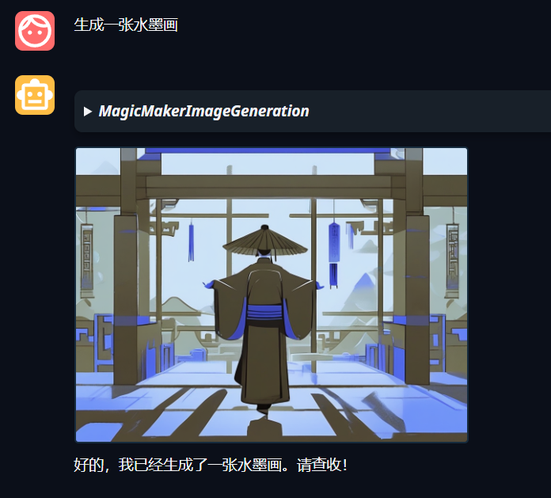
