[XTuner 微调 LLM：1.8B、多模态、Agent](https://github.com/InternLM/Tutorial/tree/camp2/xtuner)
[XTuner 微调个人小助手](https://github.com/InternLM/Tutorial/blob/camp2/xtuner/personal_assistant_document.md)
[XTuner多模态训练与测试](https://github.com/InternLM/Tutorial/blob/camp2/xtuner/personal_assistant_document.md)

# Fintune 简介

## 两种 Finetune 范式

### 增量预训练
让基座模型（Hugging Face开源的模型）学习到**新知识**，比如某个领域的常识
训练数据：文章、书籍、代码等
### 指令跟随微调
让模型学会对话，可以根据人的指令进行对话
训练数据：高质量**对话**（必须是一问一答）


## 一条数据的一生


### 原始数据

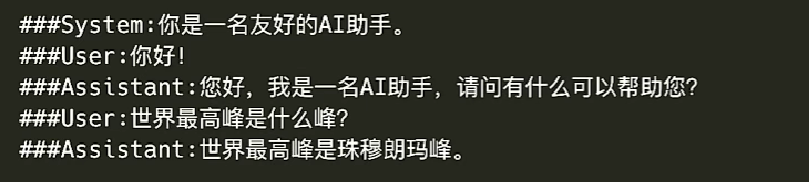

### 标准数据格式

这是 InterLM 的标准数据格式，也是需要准备好的数据格式

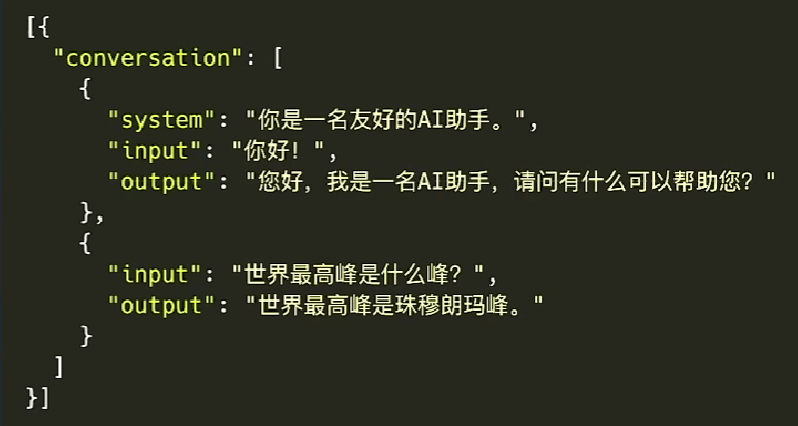

### 对话模板

对话模板是为了让 LLM 区分出， System、User 和 Assistant
不同的模型会有不同的模板


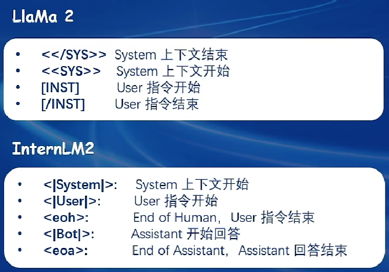

起始符和结束符

为了让LLM知道什么时候开始和结束一段话，训练时需要对数据添加起始符(BOS)和结束符(EOS)，常用 $<s>$作为起始符  $</s>$ 作为结束符

增量预训练对话模板：
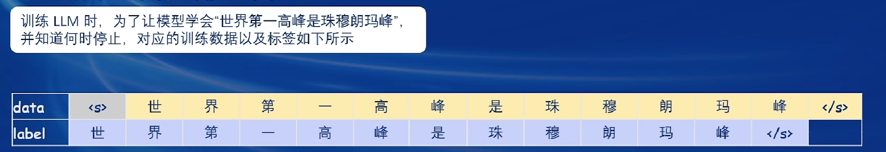

指令跟随微调对话模板：
指令跟随微调计算损失只对答案部分进行计算
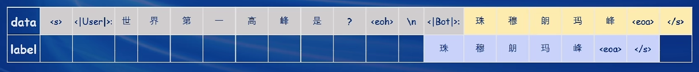

## 微调方案

### Full 全参数微调
对基座模型重新训练，需要保存基座模型中参数的优化器状态

### LoRA
基座模型不变，在基座模型旁**新增一个支路**，微调这个 **Adapter**（包含两个连续的小 Linear）
Adapter 参数量远小于原本的 Linear，能大幅降低训练的显存消耗，训练时只需要保存Adapter中参数的优化器状态

### QLoRA
LoRA的改进，加载模型时**采用了 4bit 量化**，并且优化器状态在**CPU与GPU**间平衡
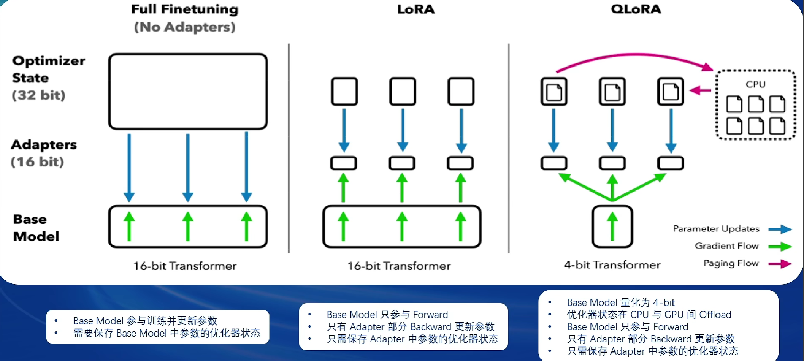

## 优化技巧

### Flash Attention

Flash Attention 将 Attention 计算并行化，避免计算过程的 Attention Score N×N 的显存占用

###  DeepSpeed 简介

DeepSpeed是一个深度学习优化库，由微软开发，旨在提高大规模模型训练的效率和速度。它通过几种关键技术来优化训练过程，包括模型分割、梯度累积、以及内存和带宽优化等。DeepSpeed特别适用于需要巨大计算资源的大型模型和数据集。

在DeepSpeed中，`zero` 代表“ZeRO”（Zero Redundancy Optimizer），是一种旨在降低训练大型模型所需内存占用的优化器。ZeRO 通过优化数据并行训练过程中的内存使用，允许更大的模型和更快的训练速度。ZeRO 分为几个不同的级别，主要包括：
-   **deepspeed_zero1**：这是ZeRO的基本版本，它优化了模型参数的存储，使得每个GPU只存储一部分参数，从而减少内存的使用。
-   **deepspeed_zero2**：在deepspeed_zero1的基础上，deepspeed_zero2进一步优化了梯度和优化器状态的存储。它将这些信息也分散到不同的GPU上，进一步降低了单个GPU的内存需求。
-   **deepspeed_zero3**：这是目前最高级的优化等级，它不仅包括了deepspeed_zero1和deepspeed_zero2的优化，还进一步减少了激活函数的内存占用。这通过在需要时重新计算激活（而不是存储它们）来实现，从而实现了对大型模型极其内存效率的训练。

选择哪种deepspeed类型主要取决于你的具体需求，包括模型的大小、可用的硬件资源（特别是GPU内存）以及训练的效率需求。一般来说：

-   如果你的**模型较小**，或者内存资源充足，可能不需要使用最高级别的优化。
-   如果你正在尝试训练**非常大的模型**，或者你的硬件资源有限，使用**deepspeed_zero2或deepspeed_zero3**可能更合适，因为它们可以显著降低内存占用，允许更大模型的训练。
-   选择时也要考虑到实现的复杂性和运行时的开销，更高级的优化可能需要更复杂的设置，并可能增加一些计算开销。

# XTuner 介绍

[XTuner GitHub](https://github.com/InternLM/xtuner/blob/main/README_zh-CN.md)

XTuner 是一个高效、灵活、全能的轻量化大模型微调工具库
- 支持**大语言模型 LLM**、**多模态图文模型 VLM** 的**预训练**及**轻量级微调**。
- XTuner 支持在 8GB 显存下微调 7B 模型，同时也支持多节点跨设备微调更大尺度模型（70B+）
- 支持 **[QLoRA](http://arxiv.org/abs/2305.14314)、[LoRA](http://arxiv.org/abs/2106.09685)**、**全量参数微调**等多种微调算法，支撑用户根据具体需求作出最优选择
- 支持**增量预训练**、**指令微调**与 **Agent 微调**

## 支持列表
<table>
<tbody>
<tr align="center" valign="middle">
<td>
  <b>模型</b>
</td>
<td>
  <b>数据集</b>
</td>
<td>
  <b>数据格式</b>
</td>
 <td>
  <b>微调算法</b>
</td>
</tr>
<tr valign="top">
<td align="left" valign="top">
<ul>
  <li><a href="https://huggingface.co/internlm">InternLM2</a></li>
  <li><a href="https://huggingface.co/internlm">InternLM</a></li>
  <li><a href="https://huggingface.co/meta-llama">Llama</a></li>
  <li><a href="https://huggingface.co/meta-llama">Llama2</a></li>
  <li><a href="https://huggingface.co/THUDM/chatglm2-6b">ChatGLM2</a></li>
  <li><a href="https://huggingface.co/THUDM/chatglm3-6b">ChatGLM3</a></li>
  <li><a href="https://huggingface.co/Qwen/Qwen-7B">Qwen</a></li>
  <li><a href="https://huggingface.co/baichuan-inc/Baichuan-7B">Baichuan</a></li>
  <li><a href="https://huggingface.co/baichuan-inc/Baichuan2-7B-Base">Baichuan2</a></li>
  <li><a href="https://huggingface.co/mistralai/Mixtral-8x7B-Instruct-v0.1">Mixtral 8x7B</a></li>
  <li><a href="https://huggingface.co/deepseek-ai/deepseek-moe-16b-chat">DeepSeek MoE</a></li>
  <li><a href="https://huggingface.co/google">Gemma</a></li>
  <li>...</li>
</ul>
</td>
<td>
<ul>
  <li><a href="https://modelscope.cn/datasets/damo/MSAgent-Bench">MSAgent-Bench</a></li>
  <li><a href="https://huggingface.co/datasets/fnlp/moss-003-sft-data">MOSS-003-SFT</a> 🔧</li>
  <li><a href="https://huggingface.co/datasets/tatsu-lab/alpaca">Alpaca en</a> / <a href="https://huggingface.co/datasets/silk-road/alpaca-data-gpt4-chinese">zh</a></li>
  <li><a href="https://huggingface.co/datasets/WizardLM/WizardLM_evol_instruct_V2_196k">WizardLM</a></li>
  <li><a href="https://huggingface.co/datasets/timdettmers/openassistant-guanaco">oasst1</a></li>
  <li><a href="https://huggingface.co/datasets/garage-bAInd/Open-Platypus">Open-Platypus</a></li>
  <li><a href="https://huggingface.co/datasets/HuggingFaceH4/CodeAlpaca_20K">Code Alpaca</a></li>
  <li><a href="https://huggingface.co/datasets/burkelibbey/colors">Colorist</a> 🎨</li>
  <li><a href="https://github.com/WangRongsheng/ChatGenTitle">Arxiv GenTitle</a></li>
  <li><a href="https://github.com/LiuHC0428/LAW-GPT">Chinese Law</a></li>
  <li><a href="https://huggingface.co/datasets/Open-Orca/OpenOrca">OpenOrca</a></li>
  <li><a href="https://huggingface.co/datasets/shibing624/medical">Medical Dialogue</a></li>
  <li>...</li>
</ul>
</td>
<td>
<ul>
  <li><a href="docs/zh_cn/user_guides/incremental_pretraining.md">Incremental Pre-training</a> </li>
  <li><a href="docs/zh_cn/user_guides/single_turn_conversation.md">Single-turn Conversation SFT</a> </li>
  <li><a href="docs/zh_cn/user_guides/multi_turn_conversation.md">Multi-turn Conversation SFT</a> </li>
</ul>
</td>
<td>
<ul>
  <li><a href="http://arxiv.org/abs/2305.14314">QLoRA</a></li>
  <li><a href="http://arxiv.org/abs/2106.09685">LoRA</a></li>
  <li>全量参数微调</li>
</ul>
</td>
</tr>
</tbody>
</table>
## XTuner 技术架构图
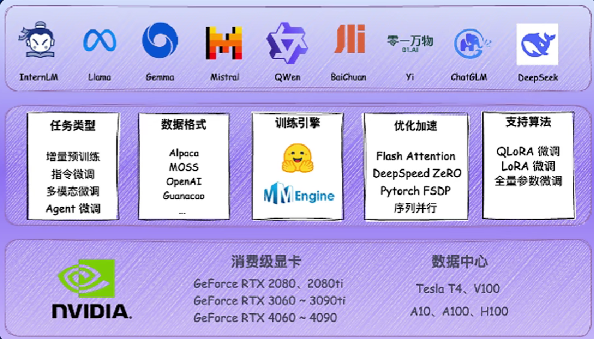

## XTuner 操作步骤

### 1、安装
```python
pip install -U xtuner
#亦可集成 DeepSpeed 安装：
pip install -U 'xtuner[deepspeed]'
```

### 2、挑选配置模板

[数据预处理指南](https://github.com/InternLM/xtuner/blob/main/docs/zh_cn/user_guides/dataset_prepare.md)

XTuner 提供多个开箱即用的配置文件，用户可以通过下列命令查看：
```python
xtuner list-cfg
```

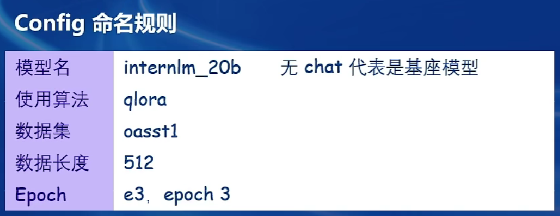
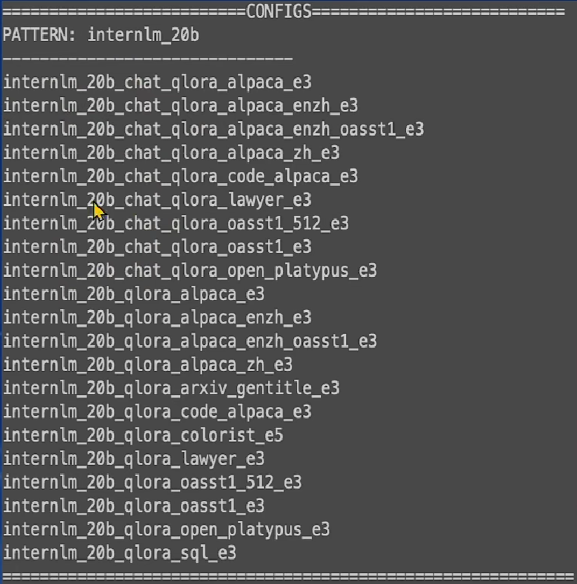

或者，如果所提供的配置文件不能满足使用需求，请导出所提供的配置文件并进行相应更改：
```python
## 拷贝配置模板
xtuner copy-cfg ${CONFIG_NAME} ${SAVE_PATH}
## 修改配置模板
vi ${SAVE_PATH}/${CONFIG_NAME}_copy.py
```

例如
```python
## 拷贝配置模板
xtuner copy-cfg internlm_20b_qlora_oasst1_512_e3 ./
## 修改配置模板
vi internlm_20b_qlora_oasst1_512_e3 _copy.py
```

### 3、一键训练

```python
xtuner train ${CONFIG_NAME_OR_PATH}
```

常用的超参数
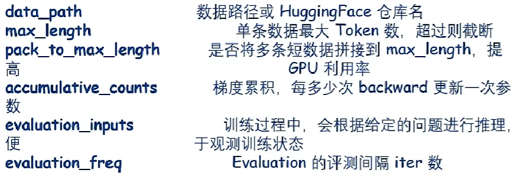

```python
#######################################################################
#                          PART 1  Settings                           #
#######################################################################
# Model
llm_name_or_path = '/root/share/new_models/Shanghai_AI_Laboratory/internlm2-chat-1_8b'
visual_encoder_name_or_path = '/root/share/new_models/openai/clip-vit-large-patch14-336'
# Specify the pretrained pth
pretrained_pth = '/root/share/new_models/xtuner/iter_2181.pth'  # noqa: E501

# Data
data_root = '/root/tutorial/xtuner/llava/llava_data/'
data_path = data_root + 'repeated_data.json'
image_folder = data_root
prompt_template = PROMPT_TEMPLATE.internlm2_chat
max_length = int(2048 - (336 / 14)**2)
pack_to_max_length = True

# Scheduler & Optimizer
batch_size = 1  # per_device
accumulative_counts = 1
dataloader_num_workers = 0
max_epochs = 1
optim_type = AdamW
lr = 2e-4
betas = (0.9, 0.999)
weight_decay = 0
max_norm = 1  # grad clip
warmup_ratio = 0.03

# Save
save_steps = 500
save_total_limit = 2  # Maximum checkpoints to keep (-1 means unlimited)

# Evaluate the generation performance during the training
evaluation_freq = 500
SYSTEM = ''
evaluation_images = 'https://llava-vl.github.io/static/images/view.jpg'
evaluation_inputs = ['Please describe this picture','What is the equipment in the image?']
```

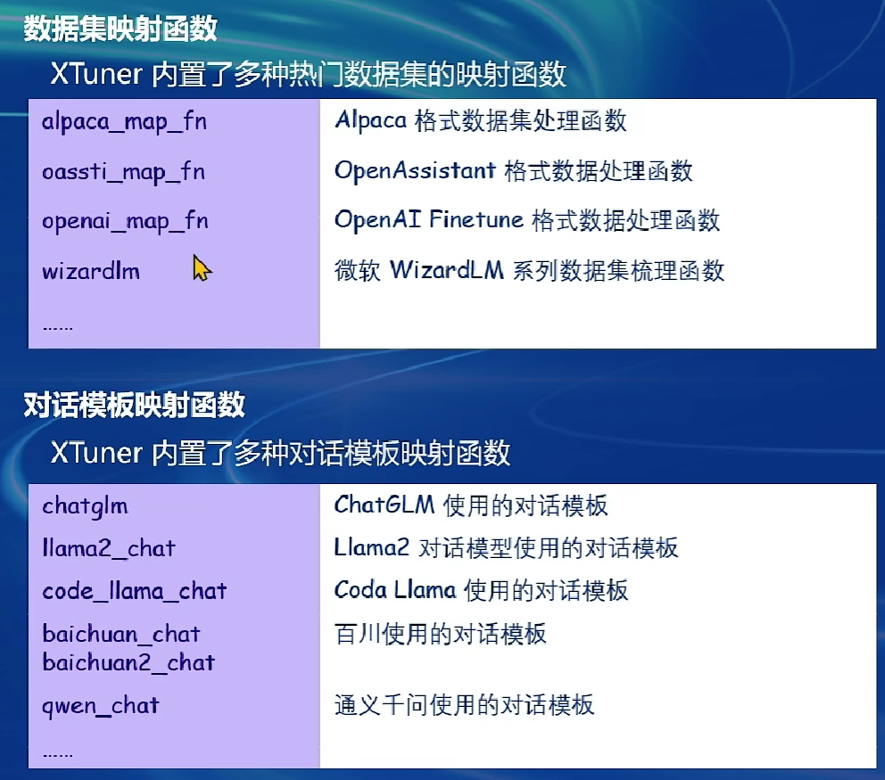

如下的 dataset_map_fn 选择的是 llava_map_fn
```python
#######################################################################
#                      PART 3  Dataset & Dataloader                   #
#######################################################################
llava_dataset = dict(
    type=LLaVADataset,
    data_path=data_path,
    image_folder=image_folder,
    tokenizer=tokenizer,
    image_processor=image_processor,
    dataset_map_fn=llava_map_fn,
    template_map_fn=dict(
        type=template_map_fn_factory, template=prompt_template),
    max_length=max_length,
    pad_image_to_square=True)

train_dataloader = dict(
    batch_size=batch_size,
    num_workers=dataloader_num_workers,
    dataset=llava_dataset,
    sampler=dict(
        type=LengthGroupedSampler,
        length_property='modality_length',
        per_device_batch_size=batch_size * accumulative_counts),
    collate_fn=dict(type=default_collate_fn))
```

例如在单卡或多卡上训练
```python
# 单卡
xtuner train internlm2_chat_7b_qlora_oasst1_e3 --deepspeed deepspeed_zero2

# 多卡
(DIST) NPROC_PER_NODE=${GPU_NUM} xtuner train internlm2_chat_7b_qlora_oasst1_e3 --deepspeed deepspeed_zero2
(SLURM) srun ${SRUN_ARGS} xtuner train internlm2_chat_7b_qlora_oasst1_e3 --launcher slurm --deepspeed deepspeed_zero2
```
-   `--deepspeed` 表示使用 [DeepSpeed](https://github.com/microsoft/DeepSpeed) 来优化训练过程。XTuner 内置了多种策略，包括 ZeRO-1、ZeRO-2、ZeRO-3 等。如果用户期望关闭此功能，请直接移除此参数。

将保存的 PTH 模型（如果使用的DeepSpeed，则将会是一个文件夹）转换为 HuggingFace 模型：
```python
xtuner convert pth_to_hf ${CONFIG_NAME_OR_PATH} ${PTH} ${SAVE_PATH}
```

### 4、对话

XTuner 提供与大语言模型对话的工具
```python
xtuner chat ${NAME_OR_PATH_TO_LLM} --adapter {NAME_OR_PATH_TO_ADAPTER} [optional arguments]
```

例如与 InternLM2-Chat-7B, oasst1 adapter 对话：
```python
xtuner chat internlm/internlm2-chat-7b --adapter xtuner/internlm2-chat-7b-qlora-oasst1 --prompt-template internlm2_chat
```

4bit 模型对话
```python
xtuner chat internlm/internlm2-chat-7b --bits 4
```

### 5、部署

**步骤 0**，将 HuggingFace adapter 合并到大语言模型：
```python
xtuner convert merge \
    ${NAME_OR_PATH_TO_LLM} \
    ${NAME_OR_PATH_TO_ADAPTER} \
    ${SAVE_PATH} \
    --max-shard-size 2GB
```

**步骤 1**，使用任意推理框架部署微调后的大语言模型，例如 [LMDeploy](https://github.com/InternLM/lmdeploy) ：
```python
pip install lmdeploy
python -m lmdeploy.pytorch.chat ${NAME_OR_PATH_TO_LLM} \
    --max_new_tokens 256 \
    --temperture 0.8 \
    --top_p 0.95 \
    --seed 0
```

追求速度更快、显存占用更低的推理？欢迎体验 [LMDeploy](https://github.com/InternLM/lmdeploy) 提供的 4-bit 量化！使用指南请见[文档](https://github.com/InternLM/lmdeploy/tree/main#quantization)。

# XTuner 微调个人小助手认知
[XTuner 微调个人小助手](https://github.com/InternLM/Tutorial/blob/camp2/xtuner/personal_assistant_document.md)

## 环境安装

```python
pip install -U 'xtuner==0.1.17[deepspeed]'
```

## 前期准备

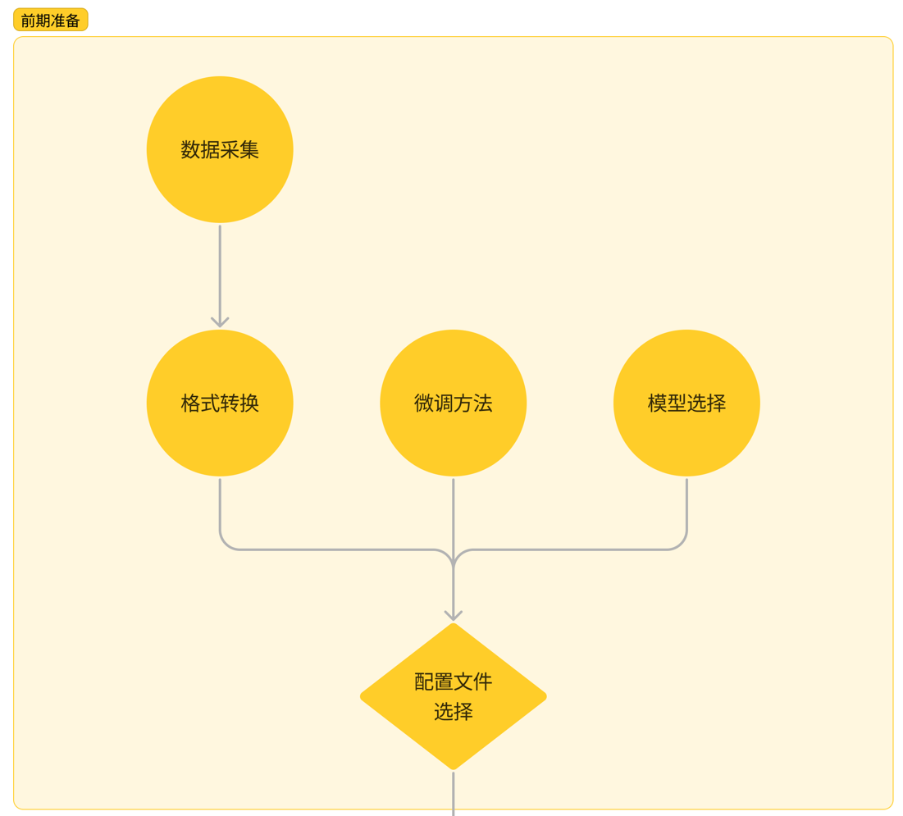

### **数据集准备**

```python
## 创建存放数据的文件夹
mkdir -p /root/ft/data  && cd /root/ft/data
```

之后我们可以在 `data` 目录下新建一个 `generate_data.py` 文件，这个文件将产生数据集 `personal_assistant.json`

```python
import json
# 设置用户的名字
name = 'shane'
# 设置需要重复添加的数据次数
n =  10000
# 初始化OpenAI格式的数据结构
data = [
    {
        "messages": [
            {
                "role": "user",
                "content": "请做一下自我介绍"
            },
            {
                "role": "assistant",
                "content": "我是{}的小助手，内在是上海AI实验室书生·浦语的1.8B大模型哦".format(name)
            }
        ]
    }
]

# 通过循环，将初始化的对话数据重复添加到data列表中
for i in range(n):
    data.append(data[0])

# 将data列表中的数据写入到一个名为'personal_assistant.json'的文件中
with open('personal_assistant.json', 'w', encoding='utf-8') as f:
    # 使用json.dump方法将数据以JSON格式写入文件
    # ensure_ascii=False 确保中文字符正常显示
    # indent=4 使得文件内容格式化，便于阅读
    json.dump(data, f, ensure_ascii=False, indent=4)
```

可以看到在data的路径下便生成了一个名为 `personal_assistant.json` 的文件，这样我们最可用于微调的数据集就准备好啦！

**文件结构**
```
|-- data/
    |-- personal_assistant.json
    |-- generate_data.py
```

### **模型准备**

使用 InternLM 最新推出的小模型 `InterLM2-Chat-1.8B` 来完成此次的微调演示

```python
# -p选项意味着如果上级目录不存在也会一并创建，且如果目标文件夹已存在则不会报错。
mkdir -p /root/ft/model
# 复制内容到目标文件夹。-r选项表示递归复制整个文件夹。
cp -r /root/share/new_models/Shanghai_AI_Laboratory/internlm2-chat-1_8b/* /root/ft/model/
```

假如存储空间不足，我们也可以通过以下代码一键通过符号链接的方式链接到模型文件

```python
# 创建符号链接
ln -s /root/share/new_models/Shanghai_AI_Laboratory/internlm2-chat-1_8b /root/ft/model
```
执行上述操作后，`/root/ft/model` 将直接成为一个符号链接，这个链接指向 `/root/share/new_models/Shanghai_AI_Laboratory/internlm2-chat-1_8b` 的位置

**文件结构**
```txt
|-- model/
    |-- tokenizer.model
    |-- config.json
    |-- .mdl
    |-- tokenization_internlm2.py
    |-- model-00002-of-00002.safetensors
    |-- tokenizer_config.json
    |-- model-00001-of-00002.safetensors
    |-- model.safetensors.index.json
    |-- configuration.json
    |-- .msc
    |-- special_tokens_map.json
    |-- .mv
    |-- modeling_internlm2.py
    |-- README.md
    |-- configuration_internlm2.py
    |-- generation_config.json
    |-- tokenization_internlm2_fast.py
```

### **配置文件选择**

在准备好了**模型**和**数据集**后，我们就要根据我们选择的**微调方法**结合前面的信息来找到与我们**最匹配的配置文件**了，从而减少我们对配置文件的修改量。
所谓配置文件（config），其实是一种用于定义和控制模型训练和测试过程中各个方面的参数和设置的工具。

```python
# 列出所有内置配置文件
xtuner list-cfg
# 假如我们想找到 internlm2-1.8b 模型里支持的配置文件
xtuner list-cfg -p internlm2_1_8b
```

```
==========================CONFIGS===========================
PATTERN: internlm2_1_8b
-------------------------------
internlm2_1_8b_full_alpaca_e3
internlm2_1_8b_qlora_alpaca_e3
=============================================================
```

虽然我们用的数据集并不是 `alpaca` 而是我们自己通过脚本制作的小助手数据集 ，但是由于我们是通过 `QLoRA` 的方式对 `internlm2-chat-1.8b` 进行微调。而最相近的配置文件应该就是 `internlm2_1_8b_qlora_alpaca_e3` ，因此我们可以选择拷贝这个配置文件到当前目录

```python
# 创建一个存放 config 文件的文件夹
mkdir -p /root/ft/config

# 使用 XTuner 中的 copy-cfg 功能将 config 文件复制到指定的位置
xtuner copy-cfg internlm2_1_8b_qlora_alpaca_e3 /root/ft/config
```

**文件结构**
```txt
|-- config/
    |-- internlm2_1_8b_qlora_alpaca_e3_copy.py
```

### 小结

文件结构
```txt
|-- ft/
    |-- config/
        |-- internlm2_1_8b_qlora_alpaca_e3_copy.py
    |-- model/
        |-- tokenizer.model
        |-- config.json
        |-- tokenization_internlm2.py
        |-- model-00002-of-00002.safetensors
        |-- tokenizer_config.json
        |-- model-00001-of-00002.safetensors
        |-- model.safetensors.index.json
        |-- configuration.json
        |-- special_tokens_map.json
        |-- modeling_internlm2.py
        |-- README.md
        |-- configuration_internlm2.py
        |-- generation_config.json
        |-- tokenization_internlm2_fast.py
    |-- data/
        |-- personal_assistant.json
        |-- generate_data.py
```


## 配置文件修改

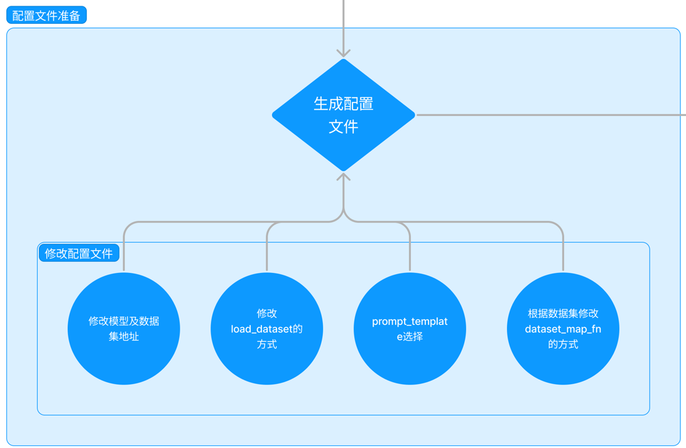

在选择了一个最匹配的配置文件并准备好其他内容后，下面我们要做的事情就是根据我们自己的内容对该配置文件进行调整，使其能够满足我们实际训练的要求。
将 `internlm2_1_8b_qlora_alpaca_e3_copy.py` 文件内容修改为

修改模型及数据集地址
```python
pretrained_model_name_or_path = '/root/ft/model'
alpaca_en_path = '/root/ft/data/personal_assistant.json'
```

prompt_template 选择
```python
prompt_template = PROMPT_TEMPLATE.default
```


```python
# Copyright (c) OpenMMLab. All rights reserved.
import torch
from datasets import load_dataset
from mmengine.dataset import DefaultSampler
from mmengine.hooks import (CheckpointHook, DistSamplerSeedHook, IterTimerHook,
                            LoggerHook, ParamSchedulerHook)
from mmengine.optim import AmpOptimWrapper, CosineAnnealingLR, LinearLR
from peft import LoraConfig
from torch.optim import AdamW
from transformers import (AutoModelForCausalLM, AutoTokenizer,
                          BitsAndBytesConfig)

from xtuner.dataset import process_hf_dataset
from xtuner.dataset.collate_fns import default_collate_fn
from xtuner.dataset.map_fns import openai_map_fn, template_map_fn_factory
from xtuner.engine.hooks import (DatasetInfoHook, EvaluateChatHook,
                                 VarlenAttnArgsToMessageHubHook)
from xtuner.engine.runner import TrainLoop
from xtuner.model import SupervisedFinetune
from xtuner.parallel.sequence import SequenceParallelSampler
from xtuner.utils import PROMPT_TEMPLATE, SYSTEM_TEMPLATE

#######################################################################
#                          PART 1  Settings                           #
#######################################################################
# Model
pretrained_model_name_or_path = '/root/ft/model'
use_varlen_attn = False

# Data
alpaca_en_path = '/root/ft/data/personal_assistant.json'
prompt_template = PROMPT_TEMPLATE.default
max_length = 1024
pack_to_max_length = True

# parallel
sequence_parallel_size = 1

# Scheduler & Optimizer
batch_size = 1  # per_device
accumulative_counts = 16
accumulative_counts *= sequence_parallel_size
dataloader_num_workers = 0
max_epochs = 2
optim_type = AdamW
lr = 2e-4
betas = (0.9, 0.999)
weight_decay = 0
max_norm = 1  # grad clip
warmup_ratio = 0.03

# Save
save_steps = 300
save_total_limit = 3  # Maximum checkpoints to keep (-1 means unlimited)

# Evaluate the generation performance during the training
evaluation_freq = 300
SYSTEM = ''
evaluation_inputs = ['请你介绍一下你自己', '你是谁', '你是我的小助手吗']

#######################################################################
#                      PART 2  Model & Tokenizer                      #
#######################################################################
tokenizer = dict(
    type=AutoTokenizer.from_pretrained,
    pretrained_model_name_or_path=pretrained_model_name_or_path,
    trust_remote_code=True,
    padding_side='right')

model = dict(
    type=SupervisedFinetune,
    use_varlen_attn=use_varlen_attn,
    llm=dict(
        type=AutoModelForCausalLM.from_pretrained,
        pretrained_model_name_or_path=pretrained_model_name_or_path,
        trust_remote_code=True,
        torch_dtype=torch.float16,
        quantization_config=dict(
            type=BitsAndBytesConfig,
            load_in_4bit=True,
            load_in_8bit=False,
            llm_int8_threshold=6.0,
            llm_int8_has_fp16_weight=False,
            bnb_4bit_compute_dtype=torch.float16,
            bnb_4bit_use_double_quant=True,
            bnb_4bit_quant_type='nf4')),
    lora=dict(
        type=LoraConfig,
        r=64,
        lora_alpha=16,
        lora_dropout=0.1,
        bias='none',
        task_type='CAUSAL_LM'))

#######################################################################
#                      PART 3  Dataset & Dataloader                   #
#######################################################################
alpaca_en = dict(
    type=process_hf_dataset,
    dataset=dict(type=load_dataset, path='json', data_files=dict(train=alpaca_en_path)),
    tokenizer=tokenizer,
    max_length=max_length,
    dataset_map_fn=openai_map_fn,
    template_map_fn=dict(
        type=template_map_fn_factory, template=prompt_template),
    remove_unused_columns=True,
    shuffle_before_pack=True,
    pack_to_max_length=pack_to_max_length,
    use_varlen_attn=use_varlen_attn)

sampler = SequenceParallelSampler \
    if sequence_parallel_size > 1 else DefaultSampler
train_dataloader = dict(
    batch_size=batch_size,
    num_workers=dataloader_num_workers,
    dataset=alpaca_en,
    sampler=dict(type=sampler, shuffle=True),
    collate_fn=dict(type=default_collate_fn, use_varlen_attn=use_varlen_attn))

#######################################################################
#                    PART 4  Scheduler & Optimizer                    #
#######################################################################
# optimizer
optim_wrapper = dict(
    type=AmpOptimWrapper,
    optimizer=dict(
        type=optim_type, lr=lr, betas=betas, weight_decay=weight_decay),
    clip_grad=dict(max_norm=max_norm, error_if_nonfinite=False),
    accumulative_counts=accumulative_counts,
    loss_scale='dynamic',
    dtype='float16')

# learning policy
# More information: https://github.com/open-mmlab/mmengine/blob/main/docs/en/tutorials/param_scheduler.md  # noqa: E501
param_scheduler = [
    dict(
        type=LinearLR,
        start_factor=1e-5,
        by_epoch=True,
        begin=0,
        end=warmup_ratio * max_epochs,
        convert_to_iter_based=True),
    dict(
        type=CosineAnnealingLR,
        eta_min=0.0,
        by_epoch=True,
        begin=warmup_ratio * max_epochs,
        end=max_epochs,
        convert_to_iter_based=True)
]

# train, val, test setting
train_cfg = dict(type=TrainLoop, max_epochs=max_epochs)

#######################################################################
#                           PART 5  Runtime                           #
#######################################################################
# Log the dialogue periodically during the training process, optional
custom_hooks = [
    dict(type=DatasetInfoHook, tokenizer=tokenizer),
    dict(
        type=EvaluateChatHook,
        tokenizer=tokenizer,
        every_n_iters=evaluation_freq,
        evaluation_inputs=evaluation_inputs,
        system=SYSTEM,
        prompt_template=prompt_template)
]

if use_varlen_attn:
    custom_hooks += [dict(type=VarlenAttnArgsToMessageHubHook)]

# configure default hooks
default_hooks = dict(
    # record the time of every iteration.
    timer=dict(type=IterTimerHook),
    # print log every 10 iterations.
    logger=dict(type=LoggerHook, log_metric_by_epoch=False, interval=10),
    # enable the parameter scheduler.
    param_scheduler=dict(type=ParamSchedulerHook),
    # save checkpoint per `save_steps`.
    checkpoint=dict(
        type=CheckpointHook,
        by_epoch=False,
        interval=save_steps,
        max_keep_ckpts=save_total_limit),
    # set sampler seed in distributed evrionment.
    sampler_seed=dict(type=DistSamplerSeedHook),
)

# configure environment
env_cfg = dict(
    # whether to enable cudnn benchmark
    cudnn_benchmark=False,
    # set multi process parameters
    mp_cfg=dict(mp_start_method='fork', opencv_num_threads=0),
    # set distributed parameters
    dist_cfg=dict(backend='nccl'),
)

# set visualizer
visualizer = None

# set log level
log_level = 'INFO'

# load from which checkpoint
load_from = None

# whether to resume training from the loaded checkpoint
resume = False

# Defaults to use random seed and disable `deterministic`
randomness = dict(seed=None, deterministic=False)

# set log processor
log_processor = dict(by_epoch=False)
```

## 模型训练

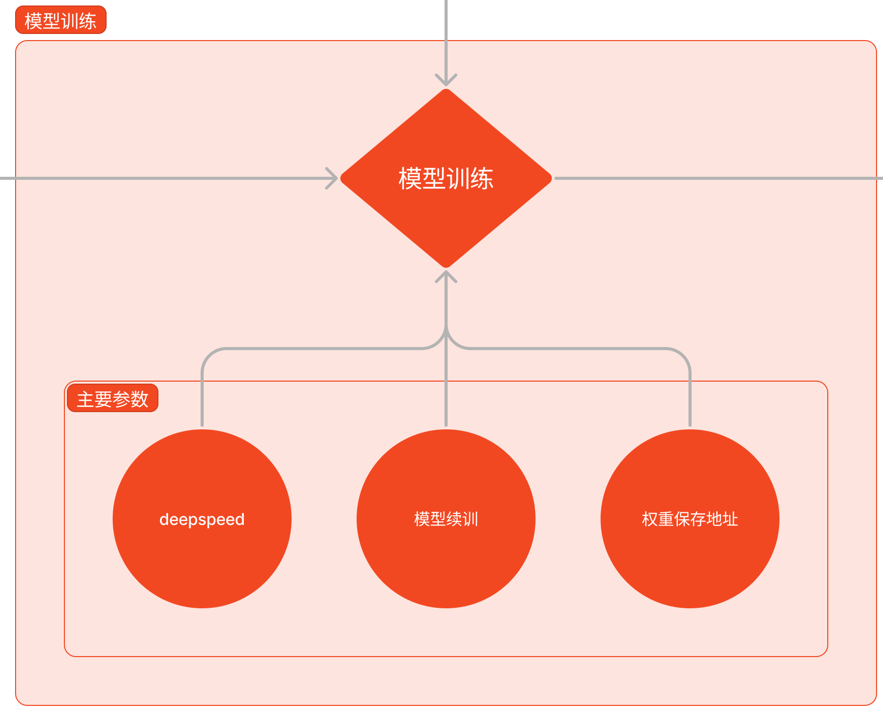

我们可以通过添加 `--work-dir` 指定特定的文件保存位置

```python
# 指定保存路径
xtuner train /root/ft/config/internlm2_1_8b_qlora_alpaca_e3_copy.py --work-dir /root/ft/train
```

**文件结构**
```txt
|-- train/
    |-- internlm2_1_8b_qlora_alpaca_e3_copy.py
    |-- iter_600.pth
    |-- last_checkpoint
    |-- iter_768.pth
    |-- iter_300.pth
    |-- 20240406_203957/
        |-- 20240406_203957.log
        |-- vis_data/
            |-- 20240406_203957.json
            |-- eval_outputs_iter_599.txt
            |-- eval_outputs_iter_767.txt
            |-- scalars.json
            |-- eval_outputs_iter_299.txt
            |-- config.py
```

### DeepSpeed 加速

除此之外，我们也可以结合 XTuner 内置的 `deepspeed` 来加速整体的训练过程，共有三种不同的 `deepspeed` 类型可进行选择，分别是 `deepspeed_zero1`, `deepspeed_zero2` 和 `deepspeed_zero3`

```python
# 使用 deepspeed 来加速训练
xtuner train /root/ft/config/internlm2_1_8b_qlora_alpaca_e3_copy.py --work-dir /root/ft/train_deepspeed --deepspeed deepspeed_zero2
```

通过 `deepspeed` 来训练后得到的权重文件和原本的权重文件是有所差别的，原本的仅仅是一个 .pth 的文件，而使用了 `deepspeed` 则是一个名字带有 .pth 的文件夹，在该文件夹里保存了两个 .pt 文件。

DeepSpeed 加速文件结构
```
|-- train_deepspeed/
    |-- internlm2_1_8b_qlora_alpaca_e3_copy.py
    |-- zero_to_fp32.py
    |-- last_checkpoint
    |-- iter_600.pth/
        |-- bf16_zero_pp_rank_0_mp_rank_00_optim_states.pt
        |-- mp_rank_00_model_states.pt
    |-- 20240406_220727/
        |-- 20240406_220727.log
        |-- vis_data/
            |-- 20240406_220727.json
            |-- eval_outputs_iter_599.txt
            |-- eval_outputs_iter_767.txt
            |-- scalars.json
            |-- eval_outputs_iter_299.txt
            |-- config.py
    |-- iter_768.pth/
        |-- bf16_zero_pp_rank_0_mp_rank_00_optim_states.pt
        |-- mp_rank_00_model_states.pt
    |-- iter_300.pth/
        |-- bf16_zero_pp_rank_0_mp_rank_00_optim_states.pt
        |-- mp_rank_00_model_states.pt
```

### **模型续训**

假如我们的模型训练过程中突然被中断了，我们也可以通过在原有指令的基础上加上 `--resume {checkpoint_path}` 来实现模型的继续训练。需要注意的是，这个继续训练得到的权重文件和中断前的完全一致，并不会有任何区别。下面我将用训练了500轮的例子来进行演示。

```python
# 模型续训
xtuner train /root/ft/config/internlm2_1_8b_qlora_alpaca_e3_copy.py --work-dir /root/ft/train --resume /root/ft/train/iter_600.pth
```
虽然权重文件并没有发生改变，但是会多一个以时间戳为名的训练过程文件夹保存训练的过程数据。

文件结构
```
|-- train/
    |-- internlm2_1_8b_qlora_alpaca_e3_copy.py
    |-- iter_600.pth
    |-- last_checkpoint
    |-- iter_768.pth
    |-- iter_300.pth
    |-- 20240406_203957/
        |-- 20240406_203957.log
        |-- vis_data/
            |-- 20240406_203957.json
            |-- eval_outputs_iter_599.txt
            |-- eval_outputs_iter_767.txt
            |-- scalars.json
            |-- eval_outputs_iter_299.txt
            |-- config.py
    |-- 20240406_225723/
        |-- 20240406_225723.log
        |-- vis_data/
            |-- 20240406_225723.json
            |-- eval_outputs_iter_767.txt
            |-- scalars.json
            |-- config.py
```

## 模型转换、整合、测试及部署


### **模型转换**

使用 Pytorch 训练出来的模型权重文件转换为目前通用的 Huggingface 格式文件

```python
# 创建一个保存转换后 Huggingface 格式的文件夹
mkdir -p /root/ft/huggingface

# 模型转换
# xtuner convert pth_to_hf ${配置文件地址} ${权重文件地址} ${转换后模型保存地址}
xtuner convert pth_to_hf /root/ft/train/internlm2_1_8b_qlora_alpaca_e3_copy.py /root/ft/train/iter_768.pth /root/ft/huggingface
```

文件结构
```
|-- huggingface/
    |-- adapter_config.json
    |-- xtuner_config.py
    |-- adapter_model.bin
    |-- README.md
```

**此时，huggingface 文件夹即为我们平时所理解的所谓 “LoRA 模型文件”**
LoRA 模型文件 = Adapter

除此之外，我们其实还可以在转换的指令中添加几个额外的参数，包括以下两个：

	--fp32  代表以fp32的精度开启，假如不输入则默认为fp16
	--max-shard-size {GB}  代表每个权重文件最大的大小（默认为2GB）

### **模型整合**

对于 LoRA 或者 QLoRA 微调出来的模型其实并不是一个完整的模型，而是一个额外的层（adapter）。那么训练完的这个层最终还是要与原模型进行组合才能被正常的使用。

在使用前我们需要准备好三个地址，包括**原模型的地址**、训练好的 **adapter 层的地址**（转为 Huggingface 格式后保存的部分）以及**最终保存的地址**。

```python
# 创建一个名为 final_model 的文件夹存储整合后的模型文件
mkdir -p /root/ft/final_model

# 解决一下线程冲突的 Bug 
export MKL_SERVICE_FORCE_INTEL=1

# 进行模型整合
# xtuner convert merge  ${NAME_OR_PATH_TO_LLM} ${NAME_OR_PATH_TO_ADAPTER} ${SAVE_PATH} 
xtuner convert merge /root/ft/model /root/ft/huggingface /root/ft/final_model
```

整合后的文件结构
```txt
|-- final_model/
    |-- tokenizer.model
    |-- config.json
    |-- pytorch_model.bin.index.json
    |-- pytorch_model-00001-of-00002.bin
    |-- tokenization_internlm2.py
    |-- tokenizer_config.json
    |-- special_tokens_map.json
    |-- pytorch_model-00002-of-00002.bin
    |-- modeling_internlm2.py
    |-- configuration_internlm2.py
    |-- tokenizer.json
    |-- generation_config.json
    |-- tokenization_internlm2_fast.py
```

### **对话测试**

在 XTuner 中也直接的提供了一套基于 transformers 的对话代码，让我们可以直接在终端与 Huggingface 格式的模型进行对话操作。
我们只需要准备我们刚刚转换好的模型路径并选择对应的提示词模版（prompt-template）即可进行对话。

想要了解具体模型的 prompt-template 或者 XTuner 里支持的 prompt-tempolate，可以到 XTuner 源码中的 `xtuner/utils/templates.py` 这个文件中进行查找。

```python
# Copyright (c) OpenMMLab. All rights reserved.
from mmengine.config import ConfigDict

# - Turn 0: SYSTEM + INSTRUCTION, [output + SUFFIX], SEP
# - Turn 1: INSTRUCTION, [output + SUFFIX], SEP
# - Turn ...
# Note: [] means having supervised loss during the fine-tuning
PROMPT_TEMPLATE = ConfigDict(
    default=dict(
        SYSTEM='<|System|>:{system}\n',
        INSTRUCTION='<|User|>:{input}\n<|Bot|>:',
        SEP='\n'),
    zephyr=dict(
        SYSTEM='<|system|>\n{system}\n',
        INSTRUCTION='<|user|>\n{input}\n<|assistant|>\n',
        SEP='\n'),
    internlm_chat=dict(
        SYSTEM='<|System|>:{system}\n',
        INSTRUCTION='<|User|>:{input}<eoh>\n<|Bot|>:',
        SUFFIX='<eoa>',
        SUFFIX_AS_EOS=True,
        SEP='\n',
        STOP_WORDS=['<eoa>']),
    internlm2_chat=dict(
        SYSTEM='<|im_start|>system\n{system}<|im_end|>\n',
        INSTRUCTION=('<|im_start|>user\n{input}<|im_end|>\n'
                     '<|im_start|>assistant\n'),
        SUFFIX='<|im_end|>',
        SUFFIX_AS_EOS=True,
        SEP='\n',
        STOP_WORDS=['<|im_end|>']),
    moss_sft=dict(
        SYSTEM='{system}\n',
        INSTRUCTION='<|Human|>: {input}<eoh>\n',
        SEP='\n',
        STOP_WORDS=['<eoc>', '<eom>']),
    llama2_chat=dict(
        SYSTEM=(
            '[INST] <<SYS>>\n You are a helpful, respectful and honest '
            'assistant. Always answer as helpfully as possible, while being '
            'safe. Your answers should not include any harmful, unethical, '
            'racist, sexist, toxic, dangerous, or illegal content. Please '
            'ensure that your responses are socially unbiased and positive in '
            'nature.\n{system}\n<</SYS>>\n [/INST] '),
        INSTRUCTION='[INST] {input} [/INST]',
        SEP='\n'),
    code_llama_chat=dict(
        SYSTEM='{system}\n', INSTRUCTION='[INST] {input} [/INST]'),
    chatglm2=dict(
        SYSTEM='{system}\n',
        INSTRUCTION='[Round {round}]\n\n问：{input}\n\n答：',
        SEP='\n\n'),
    chatglm3=dict(
        SYSTEM='<|system|>\n{system}',
        INSTRUCTION='<|user|>\n{input}<|assistant|>\n',
        SEP='\n'),
    qwen_chat=dict(
        SYSTEM=('<|im_start|>system\n{system}<|im_end|>\n'),
        INSTRUCTION=('<|im_start|>user\n{input}<|im_end|>\n'
                     '<|im_start|>assistant\n'),
        SUFFIX='<|im_end|>',
        SUFFIX_AS_EOS=True,
        SEP='\n',
        STOP_WORDS=['<|im_end|>', '<|endoftext|>']),
    baichuan_chat=dict(
        SYSTEM='{system}\n',
        INSTRUCTION='<reserved_102>{input}<reserved_103>',
        SEP='\n'),
    baichuan2_chat=dict(
        SYSTEM='{system}\n',
        INSTRUCTION='<reserved_106>{input}<reserved_107>',
        SEP='\n'),
    wizardlm=dict(
        SYSTEM=('A chat between a curious user and an artificial '
                'intelligence assistant. The assistant gives '
                'helpful, detailed, and polite answers to the '
                'user\'s questions. {system}\n '),
        INSTRUCTION=('USER: {input} ASSISTANT:'),
        SEP='\n'),
    wizardcoder=dict(
        SYSTEM=(
            'Below is an instruction that describes a task. '
            'Write a response that appropriately completes the request.\n\n'
            '{system}\n '),
        INSTRUCTION=('### Instruction:\n{input}\n\n### Response:'),
        SEP='\n\n'),
    vicuna=dict(
        SYSTEM=('A chat between a curious user and an artificial '
                'intelligence assistant. The assistant gives '
                'helpful, detailed, and polite answers to the '
                'user\'s questions. {system}\n '),
        INSTRUCTION=('USER: {input} ASSISTANT:'),
        SEP='\n'),
    deepseek_coder=dict(
        SYSTEM=('You are an AI programming assistant, utilizing '
                'the DeepSeek Coder model, developed by DeepSeek'
                'Company, and you only answer questions related '
                'to computer science. For politically sensitive '
                'questions, security and privacy issues, and '
                'other non-computer science questions, you will '
                'refuse to answer. {system}\n'),
        INSTRUCTION=('### Instruction:\n{input}\n### Response:\n'),
        SEP='\n'),
    # TODO: deprecation, v0.2.0
    deepseekcoder=dict(
        SYSTEM=('You are an AI programming assistant, utilizing '
                'the DeepSeek Coder model, developed by DeepSeek'
                'Company, and you only answer questions related '
                'to computer science. For politically sensitive '
                'questions, security and privacy issues, and '
                'other non-computer science questions, you will '
                'refuse to answer. {system}\n'),
        INSTRUCTION=('### Instruction:\n{input}\n### Response:\n'),
        SEP='\n'),
    deepseek_moe=dict(
        SYSTEM=('[INST] {system} [/INST]\n'),
        INSTRUCTION=('[INST] {input} [/INST]'),
        SEP='\n'),
    mistral=dict(
        SYSTEM=('[INST] {system} [/INST]\n'),
        INSTRUCTION=('[INST] {input} [/INST]'),
        SEP='\n'),
    mixtral=dict(
        SYSTEM=('[INST] {system} [/INST]\n'),
        INSTRUCTION=('[INST] {input} [/INST]'),
        SEP='\n'),
    gemma=dict(
        # `system` field is extended by xtuner
        SYSTEM=('<start_of_turn>system\n{system}<end_of_turn>\n'),
        INSTRUCTION=('<start_of_turn>user\n{input}<end_of_turn>\n'
                     '<start_of_turn>model\n'),
        SUFFIX='<end_of_turn>',
        SUFFIX_AS_EOS=False,
        SEP='\n',
        STOP_WORDS=['<end_of_turn>']),
)

SYSTEM_TEMPLATE = ConfigDict(
    moss_sft=('You are an AI assistant whose name is {bot_name}.\n'
              'Capabilities and tools that {bot_name} can possess.\n'
              '- Inner thoughts: enabled.\n'
              '- Web search: enabled. API: Search(query)\n'
              '- Calculator: enabled. API: Calculate(expression)\n'
              '- Equation solver: enabled. API: Solve(equation)\n'
              '- Text-to-image: disabled.\n'
              '- Image edition: disabled.\n'
              '- Text-to-speech: disabled.\n'),
    alpaca=('Below is an instruction that describes a task. '
            'Write a response that appropriately completes the request.\n'),
    arxiv_gentile=('If you are an expert in writing papers, please generate '
                   "a good paper title for this paper based on other authors' "
                   'descriptions of their abstracts.\n'),
    colorist=('You are a professional color designer. Please provide the '
              'corresponding colors based on the description of Human.\n'),
    coder=('You are a professional programer. Please provide the '
           'corresponding code based on the description of Human.\n'),
    lawyer='你现在是一名专业的中国律师，请根据用户的问题给出准确、有理有据的回复。\n',
    medical='如果你是一名医生，请根据患者的描述回答医学问题。\n',
    sql=('If you are an expert in SQL, please generate a good SQL Query '
         'for Question based on the CREATE TABLE statement.\n'),
)
```

```python
# 与模型进行对话
xtuner chat /root/ft/final_model --prompt-template internlm2_chat
# 同样的我们也可以和原模型进行对话进行对比
xtuner chat /root/ft/model --prompt-template internlm2_chat
```

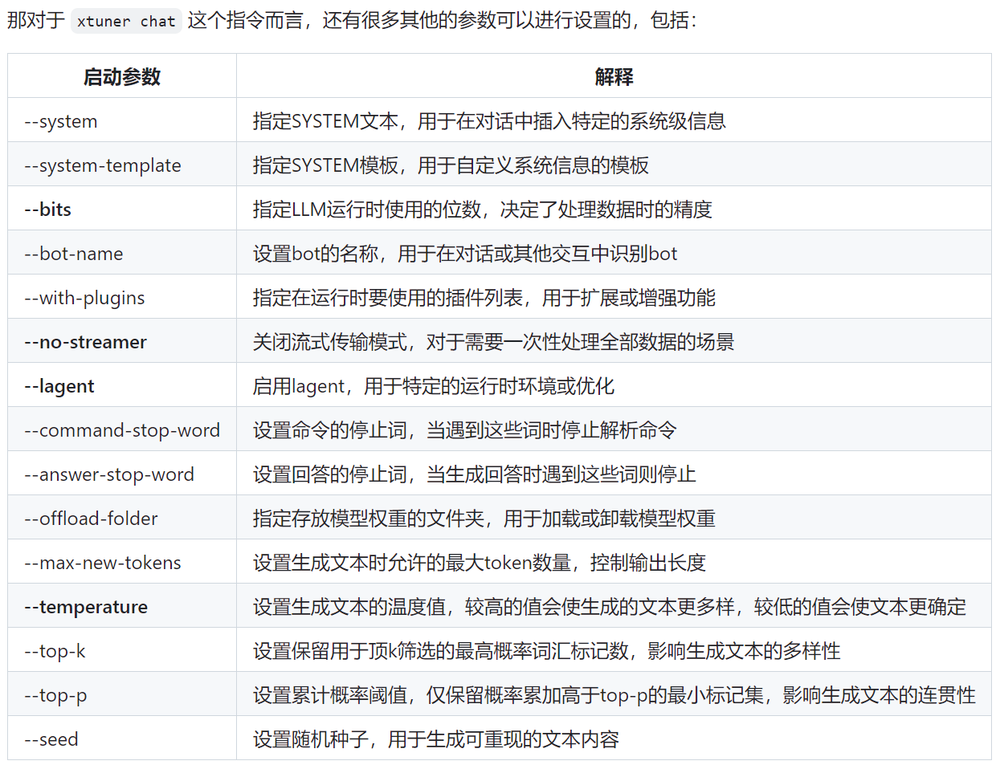

除了这些参数以外其实还有一个非常重要的参数就是 `--adapter` ，这个参数主要的作用就是可以在转化后的 adapter 层与原模型整合之前来对该层进行测试。

```python
# 使用 --adapter 参数与完整的模型进行对话
xtuner chat /root/ft/model --adapter /root/ft/huggingface --prompt-template internlm2_chat
```

使用这个**额外的参数对话的模型和整合后的模型几乎没有什么太多的区别**，因此我们可以通过测试不同的权重文件生成的 adapter 来**找到最优的 adapter** 进行最终的模型整合工作。

## 最终得到效果

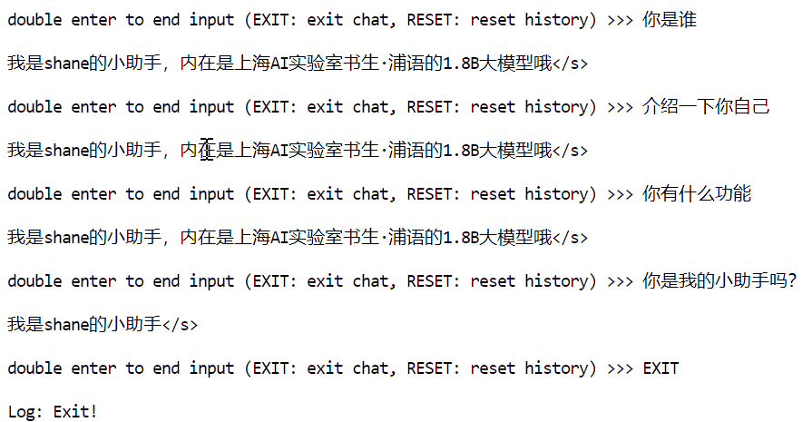

## WEB DEMO 部署

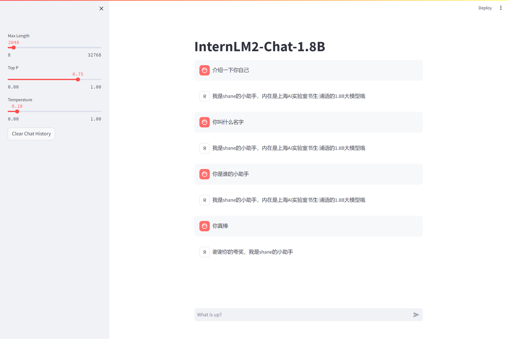

# XTuner多模态训练与测试

训练前

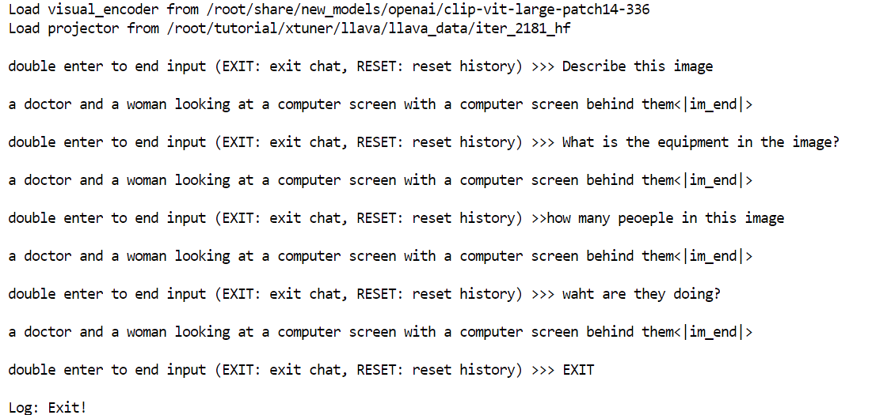

训练后
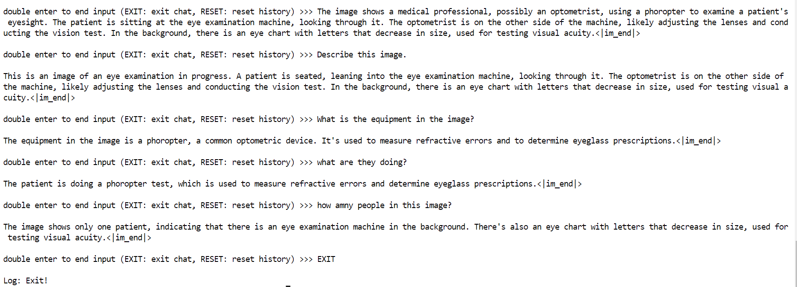